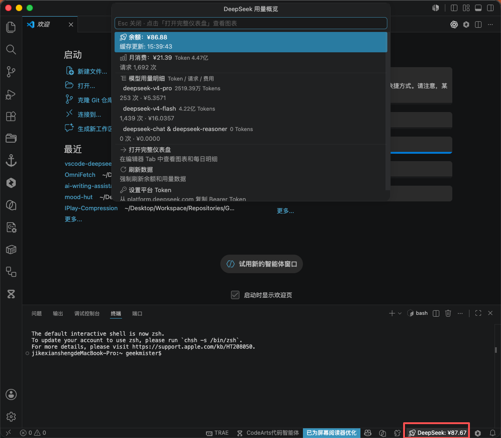
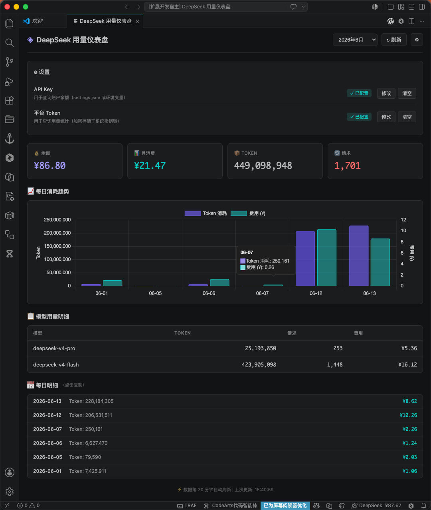

<p align="center">
  
</p>

<p align="center">
  <a href="LICENSE"></a>
  
  
  
  
</p>

<p align="center">
  <a href="https://github.com/Geekmister/vscode-deepseek-usage/stargazers">
    
  </a>
  <a href="https://github.com/Geekmister/vscode-deepseek-usage/network/members">
    
  </a>
  <a href="https://github.com/Geekmister/vscode-deepseek-usage/issues">
    
  </a>
  <a href="https://github.com/Geekmister/vscode-deepseek-usage/commits">
    
  </a>
  
</p>

<p align="center">
  A VS Code extension that brings DeepSeek's official usage dashboard right into your editor — monitor account balance, track token consumption, visualize daily usage trends, all without leaving your development workflow.
</p>

<p align="center">
  <a href="README.zh-CN.md"></a>
</p>

<p align="center">
  <b>⚡ Quick Peek via QuickPick · 📊 Full Dashboard with Chart.js · 🔒 Credentials stored encrypted via SecretStorage</b>
</p>

---





## Features

| Emoji | Feature | Description |
|-------|---------|-------------|
| 💰 | **Balance Monitoring** | Real-time API account balance display in the status bar with low-balance alerts |
| 📊 | **Usage Statistics** | Monthly token consumption, request counts, and cost breakdown by model |
| 📈 | **Chart Visualization** | Dual Y-axis bar chart (tokens + cost) via Chart.js for daily consumption trends |
| 🚀 | **QuickPick Floating Panel** | One-click status bar → floating panel with balance, usage summary, and model breakdown |
| 📋 | **Model Breakdown** | Per-model token, request, and cost details in a sortable table |
| 📅 | **Daily Details** | Click-to-copy daily breakdown for the last 7 days |
| ⚙️ | **Inline Settings** | Manage API Key and Platform Token directly from the dashboard without leaving the editor |
| 🔒 | **Encrypted Storage** | Platform Token stored via VS Code SecretStorage (macOS Keychain / Windows Credential Vault) |
| 🔄 | **Auto Refresh** | Configurable auto-refresh scheduler with rate-limit backoff and cache optimization |
| 🎨 | **Dark Console Style** | Developer-oriented dark theme UI that adapts to your VS Code color scheme |

## Quick Start

### 1. Install the Extension

Search for **"DeepSeek Usage Monitor"** in the VS Code Extension Marketplace and install, or run:

```bash
code --install-extension geekmister.deepseek-usage-monitor
```

> **Note**: The extension activates automatically on VS Code startup (`onStartupFinished`). No manual activation needed.

### 2. Configure API Key (for Balance)

```bash
# Open VS Code settings → search for "deepseek.apiKey"
# Or run the command palette (Ctrl+Shift+P) → "Preferences: Open Settings (UI)"
# Paste your API Key from https://platform.deepseek.com/api_keys
```

### 3. Configure Platform Token (for Usage Stats)

1. Log in to [platform.deepseek.com](https://platform.deepseek.com)
2. Open DevTools → Network tab → find any XHR request
3. Copy the `Authorization: Bearer <token>` header value
4. In VS Code, run `Ctrl+Shift+P` → **"DeepSeek: Set Platform Token"**
5. Paste the token (it will be stored encrypted)

### 4. Start Monitoring

Click the DeepSeek status bar item to open the QuickPick floating panel for a quick overview, or select **"Open Full Dashboard"** to see the complete analytics with charts.

## Architecture

```
vscode-deepseek-usage/
├── src/
│   ├── extension.ts              ← Entry point: activation, commands, QuickPick, status bar
│   ├── api/
│   │   ├── client.ts             ← DeepSeekAPIClient (balance query, v1.0.0)
│   │   └── platform.ts           ← PlatformClient (usage/cost API, v1.0.1)
│   ├── monitor/
│   │   ├── balance.ts            ← BalanceMonitor (caching, rate-limit handling)
│   │   └── usage.ts              ← UsageMonitor (token management, cache, refresh)
│   ├── webview/
│   │   ├── panel.ts              ← UsageDashboardPanel (Webview lifecycle + settings)
│   │   ├── template.ts           ← HTML/CSS/JS template (dashboard + settings panel)
│   │   └── chart.ts              ← Chart.js configuration generator
│   ├── scheduler/
│   │   └── scheduler.ts          ← RefreshScheduler (configurable interval + backoff)
│   └── error/
│       └── handler.ts            ← APIErrorHandler (source-aware 401/403 handling)
├── docs/
│   └── v1.0.1-iteration.md       ← Full design document (Chinese)
├── package.json
└── tsconfig.json
```

### Data Flow

```
User copies Bearer Token from browser DevTools
  → SecretStorage (encrypted, OS keychain)
    → PlatformClient fetches /api/v0/usage/amount + /api/v0/usage/cost
      → UsageMonitor._buildCache() transforms raw data
        → globalState persistent cache (30min TTL)
          → Click status bar → QuickPick floating panel (fast preview)
            → "Open Full Dashboard" → Webview Panel (Chart.js + daily details)
```

## Core Technologies

| Layer | Technology | Purpose |
|-------|-----------|---------|
| Runtime | VS Code Extension API ^1.90.0 | Webview, SecretStorage, QuickPick, StatusBar |
| Language | TypeScript 5.x | Type safety across all modules |
| Build | esbuild | Fast bundling (≈280KB output) |
| Charts | Chart.js 4.4.0 (CDN) | Dual Y-axis bar chart in Webview |
| HTTP | axios ^1.7.0 | Platform API requests |
| Storage | `context.secrets` (SecretStorage) | Encrypted token storage |
| Cache | `context.globalState` | Usage data and balance persistence |

## Commands

| Command | Description |
|---------|-------------|
| `DeepSeek: Open Usage Overview` | Open QuickPick floating panel (balance + model summary) |
| `DeepSeek: Refresh Data` | Force refresh balance and usage data |
| `DeepSeek: Set Platform Token` | Securely store platform Bearer Token |
| `DeepSeek: Clear Platform Token` | Remove stored platform Token |
| `DeepSeek: Open Full Dashboard` | Open Webview Panel with charts and daily details |

## Contributing

We welcome contributions! Please follow these guidelines:

### 🐛 Report Issues

- Search existing issues before creating a new one
- Clearly describe the problem, reproduction steps, and expected behavior
- Include VS Code version, extension version, and any relevant error messages

### 🚀 Submit Pull Requests

1. Fork the repository and create a feature branch from `main`
2. Follow [Conventional Commits](https://www.conventionalcommits.org/) for commit messages
3. Ensure TypeScript compiles with zero errors: `npx tsc --noEmit`
4. Ensure the build passes: `npm run build`
5. Update documentation if changing features
6. Submit PR to the `main` branch

### 🎨 Code Style

- Use TypeScript with strict type checking
- Follow the existing module structure (separation of concerns)
- Keep async initialization patterns consistent (`_initPromise` pattern)
- Write meaningful variable and function names in English
- Use `const` over `let` where possible

### 📝 Commit Convention

| Type | Description |
|------|-------------|
| `feat` | New feature |
| `fix` | Bug fix |
| `docs` | Documentation changes |
| `refactor` | Code refactoring |
| `perf` | Performance improvement |
| `test` | Test related changes |
| `chore` | Build/tooling/maintenance |

## Real-time Trend Dashboard

<p align="center">
  <a href="https://star-history.com/#Geekmister/vscode-deepseek-usage&Date">
    
  </a>
</p>

<p align="center">
  
</p>

<p align="center">
  <a href="https://github.com/Geekmister/vscode-deepseek-usage/graphs/contributors"></a>
</p>

## License

[MIT](LICENSE)

<p align="center">
  
</p>