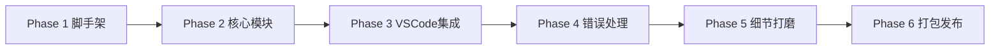

## 一、整体架构设计

一个完整的DeepSeek余量监控VSCode插件，需要涵盖以下几个核心模块：

```
DeepSeek Usage Monitor
├── 项目初始化与配置
├── API客户端模块
├── 余额监控模块
├── VSCode状态栏集成模块
├── 数据持久化（内联于BalanceMonitor）
└── 自动刷新与通知模块
```

---

## 二、项目初始化

使用官方工具生成TypeScript插件项目：

```bash
npm install -g yo generator-code
yo code
```

选择`New Extension (TypeScript)`，填写插件名称（如`deepseek-usage-monitor`）和标识符。

---

## 三、package.json 配置

在`package.json`中添加：

### 1. 激活事件
```json
"activationEvents": [
    "onStartupFinished"
]
```

### 2. 插件设置项
```json
"contributes": {
    "configuration": {
        "title": "DeepSeek Usage Monitor",
        "properties": {
            "deepseek.apiKey": {
                "type": "string",
                "default": "",
                "description": "DeepSeek API Key"
            },
            "deepseek.autoRefreshInterval": {
                "type": "number",
                "default": 30,
                "description": "自动刷新间隔（分钟）"
            },
            "deepseek.cacheTTL": {
                "type": "number",
                "default": 5,
                "minimum": 1,
                "maximum": 60,
                "description": "余额缓存时间（分钟）"
            }
        }
    }
}
```

### 3. 运行时依赖

```json
"dependencies": {
    "axios": "^1.7.0"
}
```

用户可通过`settings.json`配置API Key和刷新间隔等参数。

### 4. 命令定义
```json
"contributes": {
    "commands": [
        {
            "command": "deepseek-usage.showUsage",
            "title": "DeepSeek: Show Usage Details"
        },
        {
            "command": "deepseek-usage.refresh",
            "title": "DeepSeek: Refresh Usage Data"
        }
    ]
}
```

---

## 四、核心模块实现

### 4.1 API客户端模块

基于DeepSeek官方API构建客户端：

```typescript
import * as vscode from 'vscode';
import axios from 'axios';

const DEEPSEEK_API_BASE = 'https://api.deepseek.com';

interface DeepSeekBalanceResponse {
    is_available: boolean;
    balance_infos: Array<{
        currency: string;
        total_balance: string;
        granted_balance: string;
        topped_up_balance: string;
    }>;
}

class DeepSeekAPIClient {
    // 每次调用时实时读取 API Key，支持用户在运行时修改配置
    private getApiKey(): string {
        const config = vscode.workspace.getConfiguration('deepseek');
        return config.get('apiKey') || '';
    }
    
    // 查询账户余额
    async getBalance(): Promise<DeepSeekBalanceResponse | null> {
        const apiKey = this.getApiKey();
        if (!apiKey) {
            console.warn('DeepSeek API Key 未配置，跳过余额请求');
            return null;
        }
        const response = await axios.get(`${DEEPSEEK_API_BASE}/user/balance`, {
            headers: {
                'Authorization': `Bearer ${apiKey}`,
                'Accept': 'application/json'
            }
        });
        return response.data;
    }
}
```

余额查询API文档明确指出使用`GET https://api.deepseek.com/user/balance`接口，需要在请求头中包含Bearer Token进行认证。

> **说明**：Token 用量追踪不在插件端进行。每次 API 调用的 Token 消耗由 DeepSeek 服务端计费，插件仅通过余额接口查询剩余额度。如需了解单次调用的 Token 消耗明细，可在 API 响应体的 `usage` 字段中查看。

### 4.2 余额监控模块

```typescript
class BalanceMonitor {
    private context: vscode.ExtensionContext;
    private apiClient: DeepSeekAPIClient;
    private _currentBalance: number = 0;
    private _lastFetchTime: number = 0;
    private _lastAlertTime: number = 0;
    
    // 由 extension.ts 注入：遇到 429 限流时通知 RefreshScheduler 延长间隔
    onRateLimit: (() => void) | undefined;
    
    get currentBalance(): number {
        return this._currentBalance;
    }
    
    // 当前 API Key 为空或缓存未过期时，标记数据来自缓存
    get isBalanceFromCache(): boolean {
        const config = vscode.workspace.getConfiguration('deepseek');
        const apiKey = config.get('apiKey') || '';
        return !apiKey || this.isCacheValid();
    }
    
    constructor(context: vscode.ExtensionContext) {
        this.context = context;
        this.apiClient = new DeepSeekAPIClient();
        this.loadCachedBalance();
    }
    
    private loadCachedBalance(): void {
        this._currentBalance = this.context.globalState.get('cachedBalance', 0);
        this._lastFetchTime = this.context.globalState.get('cachedBalanceTime', 0);
    }
    
    // 检查缓存是否仍在有效期内
    private isCacheValid(): boolean {
        const config = vscode.workspace.getConfiguration('deepseek');
        const ttlMinutes = config.get('cacheTTL', 5);
        const age = Date.now() - this._lastFetchTime;
        return age < ttlMinutes * 60 * 1000;
    }
    
    // 自动刷新：缓存有效则跳过
    async refreshBalance(): Promise<number> {
        if (this.isCacheValid()) {
            return this._currentBalance;
        }
        return this._fetchBalance();
    }
    
    // 手动刷新：强制请求 API，绕过缓存
    async forceRefreshBalance(): Promise<number> {
        return this._fetchBalance();
    }
    
    // 统一的 API 请求逻辑
    private async _fetchBalance(): Promise<number> {
        try {
            const response = await this.apiClient.getBalance();
            if (response && response.is_available && response.balance_infos.length > 0) {
                const balanceInfo = response.balance_infos[0];
                this._currentBalance = parseFloat(balanceInfo.total_balance);
                this._lastFetchTime = Date.now();
                await this.context.globalState.update('cachedBalance', this._currentBalance);
                await this.context.globalState.update('cachedBalanceTime', this._lastFetchTime);
                return this._currentBalance;
            }
            return this._currentBalance;
        } catch (error) {
            // 统一通过 APIErrorHandler 处理（弹提示、指数退避等）
            // void：降级优先，错误处理在后台完成，不阻塞返回缓存值
            void APIErrorHandler.handle(error, this.context, { onRateLimit: this.onRateLimit });
            return this._currentBalance;
        }
    }
    
    // 检查是否需要余额预警（同一阈值区间至少间隔 6 小时才重复弹窗）
    async checkAlert(threshold: number = 10): Promise<boolean> {
        const cooldown = 6 * 60 * 60 * 1000; // 6 小时
        if (this._currentBalance <= threshold && this._currentBalance > 0
            && Date.now() - this._lastAlertTime > cooldown) {
            this._lastAlertTime = Date.now();
            const action = await vscode.window.showWarningMessage(
                `DeepSeek账户余额仅剩¥${this._currentBalance}，即将耗尽！`,
                '去充值', '稍后提醒'
            );
            if (action === '去充值') {
                vscode.env.openExternal(vscode.Uri.parse('https://platform.deepseek.com/top_up'));
            }
            return true;
        }
        return false;
    }
}
```

DeepSeek API返回的余额包含三部分：`total_balance`总余额、`granted_balance`赠送余额、`topped_up_balance`充值余额，扣费时优先使用赠送余额。

### 4.3 自动刷新调度

```typescript
class RefreshScheduler {
    private timer: NodeJS.Timeout | null = null;
    private refreshCallback: () => Promise<void>;
    private intervalMinutes: number;
    
    constructor(callback: () => Promise<void>, intervalMinutes: number) {
        this.refreshCallback = callback;
        this.intervalMinutes = intervalMinutes;
    }
    
    start(): void {
        if (this.timer) clearInterval(this.timer);
        this.timer = setInterval(() => {
            this.refreshCallback().catch(console.error);
        }, this.intervalMinutes * 60 * 1000);
    }
    
    stop(): void {
        if (this.timer) {
            clearInterval(this.timer);
            this.timer = null;
        }
    }
    
    updateInterval(minutes: number): void {
        this.intervalMinutes = minutes;
        this.start();
    }
    
    // 遇到限流时临时延长刷新间隔（自适应退避）
    handleRateLimit(): void {
        const extended = Math.min(this.intervalMinutes * 2, 120);
        this.intervalMinutes = extended;
        this.start();
    }
}
```

---

## 五、VSCode状态栏集成

### 5.1 创建状态栏项

```typescript
import * as vscode from 'vscode';

let statusBarItem: vscode.StatusBarItem;
let scheduler: RefreshScheduler | undefined;

export function activate(context: vscode.ExtensionContext) {
    // 创建状态栏项
    statusBarItem = vscode.window.createStatusBarItem(
        vscode.StatusBarAlignment.Right,
        100
    );
    statusBarItem.name = 'DeepSeek Usage Monitor';
    statusBarItem.tooltip = '点击查看详细用量信息';
    statusBarItem.command = 'deepseek-usage.showUsage';
    
    // 初始化各模块
    const balanceMonitor = new BalanceMonitor(context);
    
    // 注入限流回调：遇到 429 时通知 scheduler 自适应退避
    balanceMonitor.onRateLimit = () => scheduler?.handleRateLimit();
    
    const refreshCallback = async () => {
        await updateStatusBar(balanceMonitor);
    };
    
    const config = vscode.workspace.getConfiguration('deepseek');
    
    // 首次激活引导：API Key 未配置时弹欢迎提示
    const apiKey = config.get('apiKey') || '';
    if (!apiKey) {
        vscode.window.showInformationMessage(
            '🔑 DeepSeek Usage Monitor：请先配置 API Key 以查看余额',
            '配置 API Key'
        ).then(selection => {
            if (selection === '配置 API Key') {
                vscode.commands.executeCommand('workbench.action.openSettings', 'deepseek.apiKey');
            }
        });
    }
    
    // 启动自动刷新调度
    const interval = config.get('autoRefreshInterval', 30);
    scheduler = new RefreshScheduler(refreshCallback, interval);
    scheduler.start();
    
    // 初始更新
    refreshCallback();
    
    // 监听配置变更（注册到 context 确保插件停用时自动清理）
    context.subscriptions.push(
        vscode.workspace.onDidChangeConfiguration(async (event) => {
            if (event.affectsConfiguration('deepseek.autoRefreshInterval')) {
                const newInterval = vscode.workspace.getConfiguration('deepseek')
                    .get('autoRefreshInterval', 30);
                scheduler.updateInterval(newInterval);
            }
        })
    );
    
    // 注册命令
    context.subscriptions.push(
        statusBarItem,
        vscode.commands.registerCommand('deepseek-usage.showUsage', async () => {
            // 点击状态栏时先强制拉取最新余额，再弹窗
            await balanceMonitor.forceRefreshBalance();
            showUsageDetails(balanceMonitor);
        }),
        vscode.commands.registerCommand('deepseek-usage.refresh', async () => {
            await balanceMonitor.forceRefreshBalance();
            await updateStatusBar(balanceMonitor);
        })
    );
}

export function deactivate() {
    scheduler?.stop();
}
```

状态栏项的创建和显示是VSCode插件扩展UI的核心能力，通过`vscode.window.createStatusBarItem`创建后，可以设置文本、图标、提示信息和点击行为。

### 5.2 更新状态栏显示

```typescript
async function updateStatusBar(
    balanceMonitor: BalanceMonitor
): Promise<void> {
    try {
        const balance = await balanceMonitor.refreshBalance();
        const config = vscode.workspace.getConfiguration('deepseek');
        const apiKey = config.get('apiKey') || '';
        
        // API Key 未配置时显示提示，而非 ¥0.00 造成困惑
        if (!apiKey) {
            statusBarItem.text = `$(key) DeepSeek: 未配置`;
            statusBarItem.backgroundColor = new vscode.ThemeColor('statusBarItem.warningBackground');
            statusBarItem.tooltip = '点击查看详情';
            statusBarItem.show();
            return;
        }
        
        // 格式化显示
        let statusText = `$(rocket) DeepSeek: ¥${balance.toFixed(2)}`;
        
        // 余额不足时改变颜色
        if (balance < 10) {
            statusBarItem.backgroundColor = new vscode.ThemeColor('statusBarItem.warningBackground');
        } else {
            statusBarItem.backgroundColor = undefined;
        }
        
        statusBarItem.text = statusText;
        statusBarItem.show();
        
        // 余额检查
        await balanceMonitor.checkAlert(10);
    } catch (error) {
        statusBarItem.text = `$(alert) DeepSeek: API错误`;
        statusBarItem.backgroundColor = undefined;
        statusBarItem.tooltip = '无法获取余额，稍后重试';
        statusBarItem.show();
    }
}

function showUsageDetails(
    balanceMonitor: BalanceMonitor
): void {
    const config = vscode.workspace.getConfiguration('deepseek');
    const balance = balanceMonitor.currentBalance;
    const apiKey = config.get('apiKey') || '';
    const isCache = balanceMonitor.isBalanceFromCache;
    
    const lowBalance = balance <= 10 && apiKey;
    
    const balanceLine = isCache
        ? `- 当前余额：¥${balance.toFixed(2)}（${lowBalance ? '⚠️ ' : ''}缓存，可能非实时）`
        : `- 当前余额：${lowBalance ? '⚠️ ' : ''}¥${balance.toFixed(2)}`;
    
    const keyLine = apiKey
        ? `- API Key：...${apiKey.slice(-8)}`
        : `- API Key：未配置 ⚠️ 余额来自上次缓存`;
    
    const message = `
📊 **DeepSeek 账户详情**

💰 **余额信息**
${balanceLine}
${keyLine}

💡 **提示**：余额每 ${config.get('autoRefreshInterval', 30)} 分钟自动刷新，也可点击下方「刷新」按钮手动更新
    `;
    
    vscode.window.showInformationMessage(message, { modal: true }, '刷新')
        .then(selection => {
            if (selection === '刷新') {
                vscode.commands.executeCommand('deepseek-usage.refresh');
            }
        });
}
```

状态栏可以显示文本和图标，并结合定时器或事件监听动态更新内容。通过`globalState`可以实现跨工作区的数据持久化存储。

---

## 六、数据持久化方案

本插件的持久化需求非常简单——仅缓存余额和时间戳。因此不在单独的类中封装，直接在 `BalanceMonitor` 中通过 `ExtensionContext.globalState` 读写。

`globalState` 是 VSCode 提供的跨工作区持久化存储，数据写入磁盘文件，重启后仍可恢复。`BalanceMonitor` 的 `loadCachedBalance()` 和 `_fetchBalance()` 分别负责读取和写入以下两个键：

| 键名 | 类型 | 说明 |
|------|------|------|
| `cachedBalance` | `number` | 最近一次成功查询的余额 |
| `cachedBalanceTime` | `number` | 余额缓存时间戳（`Date.now()`） |

> **说明**：不封装为单独的 DataPersistence 类的原因是持久化逻辑已内聚在 `BalanceMonitor` 中。如果未来需要增加更多持久化字段，再考虑提取独立模块。

---

## 七、错误处理与健壮性

### 7.1 API错误处理

```typescript
enum APIErrorType {
    AUTH_ERROR = 'authentication_error',
    RATE_LIMIT = 'rate_limit_exceeded',
    NETWORK_ERROR = 'network_error',
    INSUFFICIENT_BALANCE = 'insufficient_balance'
}

interface ErrorHandlerOptions {
    onRateLimit?: () => void;
}

class APIErrorHandler {
    private static retryCount = 0;
    
    static async handle(error: any, context: vscode.ExtensionContext, options?: ErrorHandlerOptions): Promise<void> {
        if (error.response?.status === 401 || error.response?.status === 403) {
            vscode.window.showErrorMessage(
                'DeepSeek API认证失败，请检查API Key配置',
                '配置API Key'
            ).then(selection => {
                if (selection === '配置API Key') {
                    vscode.commands.executeCommand('workbench.action.openSettings', 'deepseek.apiKey');
                }
            });
        } else if (error.response?.status === 429) {
            vscode.window.showWarningMessage('DeepSeek API请求过于频繁，请稍后再试');
            // 指数退避重试
            await this.exponentialBackoff();
            // 通知调度器延长刷新间隔
            options?.onRateLimit?.();
        } else if (error.code === 'ECONNREFUSED' || error.code === 'ENOTFOUND') {
            vscode.window.showWarningMessage('网络连接失败，将使用缓存数据');
        } else {
            console.error('Unhandled API error:', error);
        }
    }
    
    private static async exponentialBackoff(): Promise<void> {
        if (this.retryCount < 3) {
            const delay = Math.pow(2, this.retryCount) * 1000;
            await new Promise(resolve => setTimeout(resolve, delay));
            this.retryCount++;
        } else {
            this.retryCount = 0;
        }
    }
}
```

DeepSeek API在高负载时会返回503或429错误码并实施动态限流，建议实现指数退避重试机制。

### 7.2 部署配置

#### 构建工具（esbuild）

官方推荐使用 `esbuild` 替代 `tsc` 裸编译，体积小、速度快：

```bash
npm install -D esbuild
```

在 `package.json` 中添加构建脚本：

```json
"scripts": {
    "vscode:prepublish": "npm run build",
    "build": "esbuild src/extension.ts --bundle --outfile=out/extension.js --external:vscode --format=cjs --platform=node --minify",
    "watch": "esbuild src/extension.ts --bundle --outfile=out/extension.js --external:vscode --format=cjs --platform=node --sourcemap"
}
```

> **说明**：`--external:vscode` 排除 VSCode API 模块（运行环境提供），`--minify` 压缩产物。

#### package.json 必要字段

打包前确保 `package.json` 包含以下字段（将 `<publisher>` 替换为实际发布者）：

```json
{
    "name": "deepseek-usage-monitor",
    "displayName": "DeepSeek Usage Monitor",
    "publisher": "<your-publisher-id>",
    "version": "0.1.0",
    "license": "MIT",
    "engines": {
        "vscode": "^1.90.0"
    },
    "main": "./out/extension.js"
}
```

#### .vscodeignore

创建 `.vscodeignore` 排除源码文件，只保留运行时必需的文件：

```gitignore
.vscode/**
src/**
node_modules/**
.gitignore
tsconfig.json
.eslintrc.json
**/*.map
```

#### VSIX 打包

```bash
npm install -g @vscode/vsce
vsce package
```

打包生成 `.vsix` 文件后，可通过 VSCode 的"从 VSIX 安装"功能直接安装，或发布到 [Visual Studio Marketplace](https://marketplace.visualstudio.com/vscode)。

#### （可选）GitHub Actions 自动化发布

```yaml
# .github/workflows/publish.yml
name: Publish Extension
on:
  push:
    tags:
      - 'v*'
jobs:
  publish:
    runs-on: ubuntu-latest
    steps:
      - uses: actions/checkout@v4
      - uses: actions/setup-node@v4
        with:
          node-version: 20
      - run: npm ci
      - run: npm run build
      - run: npx vsce publish -p ${{ secrets.VSCE_PAT }}
```

---

## 八、开发计划

### Phase 1：项目脚手架（预计 0.5 天）

**目标**：搭建可运行的 TypeScript 插件骨架，验证构建链路畅通。

| # | 任务 | 涉及文件 | 产出/验收标准 |
|---|------|----------|--------------|
| 1.1 | 用 `yo code` 生成 `New Extension (TypeScript)` 项目 | 脚手架自动生成 | 项目目录结构完整，含 `.vscode/launch.json`、`tsconfig.json` |
| 1.2 | 精简 `package.json`：配置激活事件、设置项、命令 | `package.json` | 最终内容与第三章一致 |
| 1.3 | 安装运行时依赖 `axios` | `package.json` → `dependencies` | `npm ls axios` 无报错 |
| 1.4 | 安装开发依赖 `esbuild`，配置构建脚本 + `.vscodeignore` | `package.json`（scripts）、`.vscodeignore` | `npm run build` 输出 `out/extension.js` |
| 1.5 | 安装开发依赖 `@types/vscode`、`typescript` | `package.json` → `devDependencies` | TypeScript 类型检查通过 |
| 1.6 | **验证**：F5 启动 Extension Dev Host，弹出空插件 | `src/extension.ts`（仅保留 `activate` 空函数） | 窗口右下角无报错弹窗 |

**依赖**：无。  
**里程碑**：`npm run build` 通过 + F5 可启动调试容器。

---

### Phase 2：核心模块 —— 余额查询（预计 1 天）

**目标**：实现 API 客户端和余额监控逻辑，不依赖 UI。

| # | 任务 | 涉及文件 | 产出/验收标准 |
|---|------|----------|--------------|
| 2.1 | 实现 `DeepSeekAPIClient` 类（含空 API Key 保护） | `src/api/client.ts` | 新建文件；用 `axios` 封装 `GET /user/balance`；`apiKey` 为空时直接返回 null 不发起请求 |
| 2.2 | 定义 `DeepSeekBalanceResponse` 接口 | `src/api/client.ts` | 包含 `is_available`、`balance_infos`（`currency`、`total_balance`、`granted_balance`、`topped_up_balance`） |
| 2.3 | 实现 `BalanceMonitor` 类 | `src/monitor/balance.ts` | 新建文件；包含 `refreshBalance()`（走缓存）、`forceRefreshBalance()`（强制请求）、`checkAlert(threshold)`、`isCacheValid()` |
| 2.4 | 实现 TTL 缓存 + 空数组保护 | `src/monitor/balance.ts` | `refreshBalance()` 前检查缓存有效性；`_fetchBalance()` 中校验 `response.balance_infos.length > 0` |
| 2.5 | 实现预警防骚扰机制 | `src/monitor/balance.ts` | `checkAlert()` 记录 `_lastAlertTime`，同一阈值区间至少间隔 6 小时才重复弹窗 |
| 2.6 | 实现 `RefreshScheduler` 类 | `src/scheduler/scheduler.ts` | 新建文件；`start()`、`stop()`、`updateInterval()`、`handleRateLimit()` |
| 2.7 | 余额数据持久化 | `src/monitor/balance.ts` | 直接在 `BalanceMonitor` 中通过 `globalState` 读写 `cachedBalance` 和 `cachedBalanceTime`，不封装独立类 |
| 2.8 | **验证**：单元测试（可选）或手动调用 | 临时测试脚本 | 持有效 API Key 调用 `getBalance()` 返回正确余额数据；无效 Key 返回 401 |

**依赖**：Phase 1（脚手架就绪）。  
**里程碑**：核心数据层可独立工作，不依赖 VSCode UI。

---

### Phase 3：VSCode 状态栏集成（预计 1 天）

**目标**：将余额展示挂接到 VSCode 状态栏和命令系统。

| # | 任务 | 涉及文件 | 产出/验收标准 |
|---|------|----------|--------------|
| 3.1 | 编写 `activate()` 入口：创建 `StatusBarItem`、实例化模块、注册命令 | `src/extension.ts` | 状态栏项创建在右侧、优先级 100，`tooltip` 和 `command` 正确绑定 |
| 3.2 | 注册 `deepseek-usage.showUsage` 命令（先 `forceRefreshBalance()` 再弹窗） | `src/extension.ts` | 命令先强制拉取最新余额再展示详情 |
| 3.3 | 注册 `deepseek-usage.refresh` 命令（调用 `forceRefreshBalance()`） | `src/extension.ts` | 手动刷新不走缓存，直接请求 API |
| 3.4 | `onDidChangeConfiguration` 注册到 `context.subscriptions` | `src/extension.ts` | 配置变更监听器推入 `context.subscriptions`，插件停用时自动释放 |
| 3.5 | 实现 `updateStatusBar()` | `src/extension.ts`（或独立文件） | 正常显示 `$(rocket) DeepSeek: ¥xx.xx`；余额 < 10 时变色（`statusBarItem.warningBackground`）；catch 到异常显示 `$(alert) DeepSeek: API错误` |
| 3.6 | 实现 `showUsageDetails()`（含缓存标记） | `src/extension.ts` | 弹窗展示余额、API Key 掩码尾 8 位；当 Key 为空或数据来自缓存时显示`（缓存，可能非实时）`标记 |
| 3.7 | 实现 `deactivate()` | `src/extension.ts` | 插件停用时 `scheduler?.stop()` 清理定时器 |
| 3.8 | 注入 `onRateLimit` 回调：连接错误处理与调度 | `src/extension.ts` | `balanceMonitor.onRateLimit = () => scheduler?.handleRateLimit()`，遇到 429 时自动延长刷新间隔 |
| 3.9 | 连接 `BalanceMonitor` + `RefreshScheduler` | `src/extension.ts` | 启动时立即刷新一次，然后按配置间隔自动刷新 |
| 3.10 | **验证**：F5 启动，配置有效 API Key | 全部文件 | 状态栏显示余额；点击弹窗信息正确（缓存标记正常显示）；点击刷新按钮强制拉取最新数据不走缓存；配置变更后定时器同步更新；重启插件后余额缓存不丢 |

**依赖**：Phase 2（核心模块就绪）。  
**里程碑**：插件可正常安装使用，状态栏实时展示余额。

---

### Phase 4：错误处理与健壮性（预计 0.5 天）

**目标**：覆盖所有异常路径，确保插件不崩溃。

| # | 任务 | 涉及文件 | 产出/验收标准 |
|---|------|----------|--------------|
| 4.1 | 实现 `APIErrorHandler.handle()` — 401/403 | `src/error/handler.ts` | 新建文件；检测 `response.status === 401/403`，弹错误提示 + "配置 API Key" 按钮跳转设置页 |
| 4.2 | 实现 `APIErrorHandler.handle()` — 429 | `src/error/handler.ts` | 弹警告提示；调用 `exponentialBackoff()` 等待后重试；通过 `options.onRateLimit` 回调通知调度器延长刷新间隔 |
| 4.3 | 实现 `exponentialBackoff()` — 指数退避 | `src/error/handler.ts` | 重试间隔为 `2^retryCount` 秒，最多重试 3 次，计数器为内存静态变量 |
| 4.4 | 实现 `APIErrorHandler.handle()` — 网络错误 | `src/error/handler.ts` | 检测 `error.code === 'ECONNREFUSED' / 'ENOTFOUND'`，弹提示"网络连接失败，使用缓存数据" |
| 4.5 | `BalanceMonitor._fetchBalance()` 对接错误处理 | `src/monitor/balance.ts` | API 调用异常时由 `APIErrorHandler.handle()` 统一处理；`_fetchBalance()` 返回当前缓存值（降级） |
| 4.6 | 空 API Key 检测 | `src/api/client.ts` | `getBalance()` 中 `apiKey` 为空时直接返回 null 不发起请求；`isBalanceFromCache` getter 动态检查当前 Key 状态标记缓存来源 |
| 4.7 | **验证**：极端场景覆盖 | 全部文件 | 清空 API Key → 状态栏不显示余额错误；断网 → 显示"API错误"但不崩溃；连续快速刷新 → 429 后自动退避 |

**依赖**：Phase 3（UI 集成就绪）。  
**里程碑**：所有异常路径有兜底处理，插件零崩溃。

---

### Phase 5：细节打磨与视觉优化（预计 1 天）

**目标**：提升使用体验，贴合深色工具台风格。

| # | 任务 | 涉及文件 | 产出/验收标准 |
|---|------|----------|--------------|
| 5.1 | 弹窗信息排版优化：余额不足时显示红色警告符号 | `src/extension.ts` | `showUsageDetails()` 中余额低于阈值时消息体加 `⚠️` 前缀 |
| 5.2 | 状态栏文案根据余额区间显示不同图标 | `src/extension.ts` | 余额 > 50 用 `$(rocket)`；10~50 用 `$(info)`；< 10 用 `$(alert)` |
| 5.3 | **验证**：完整用户体验走查 | 全部文件 | 首次安装 → 引导配置 Key → 状态栏正常显示余额 → 余额不足时颜色/图标改变 → 断网降级优雅 |

**依赖**：Phase 4（错误处理就绪）。  
**里程碑**：达到可发布交付品质。

---

### Phase 6：打包与发布（预计 0.5 天）

**目标**：输出 VSIX 产物并上架 Marketplace。

| # | 任务 | 涉及文件 | 产出/验收标准 |
|---|------|----------|--------------|
| 6.1 | 注册 VS Code Marketplace 发布者 ID | [Marketplace](https://marketplace.visualstudio.com/manage) | 获取 `publisher` 名称 |
| 6.2 | 更新 `package.json` 中的 `publisher` 字段 | `package.json` | 填入实际发布者 ID |
| 6.3 | 生成 Personal Access Token（PAT） | [Azure DevOps](https://dev.azure.com) → Tokens | Token 具备 `Marketplace → Publish` 权限 |
| 6.4 | 配置 GitHub Actions 自动化发布 | `.github/workflows/publish.yml` | 打 `v*` tag 时自动 `vsce publish` |
| 6.5 | 添加 Repository 信息到 `package.json` | `package.json` | 补充 `repository`、`bugs`、`homepage` 字段 |
| 6.6 | 在 GitHub Secrets 中配置 `VSCE_PAT` | GitHub 仓库 Settings → Secrets | Actions 可读取到发布 Token |
| 6.7 | 打 tag 触发发布，或手动 `vsce package` 打包 | 终端 | `*.vsix` 文件生成；安装后功能正常 |
| 6.8 | **验证**：从 Marketplace 安装插件 | VSCode 扩展面板 | 搜索到插件、安装、配置 Key、状态栏正常 |

**依赖**：Phase 5（代码冻结）。  
**里程碑**：插件公开发布，用户可通过 Marketplace 安装。

---

### 依赖关系图



> **预估总工时**：约 4.5 天（单人开发，不含 review 和测试等待时间）

---

## 九、部署与使用步骤

1. **安装插件**：从VSIX文件安装或在Marketplace搜索安装
2. **配置API Key**：打开VSCode设置，搜索`deepseek.apiKey`，填入DeepSeek API Key
3. **设置刷新间隔**：可调整`deepseek.autoRefreshInterval`（默认30分钟）
4. **查看余额**：底部状态栏显示当前余额，点击可查看详情弹窗

---

## 十、注意事项

1. **缓存策略**：为避免频繁调用API导致限流，余额数据默认缓存5分钟（可通过`deepseek.cacheTTL`调整），状态栏显示优先使用缓存。
2. **模型与价格**：当前在售模型为 `deepseek-v4-flash` 和 `deepseek-v4-pro`，旧名称 `deepseek-chat`/`deepseek-reasoner` 将于 2026/07/24 弃用。价格以官方定价页为准，插件不内置价格表。
3. **并发限制**：`deepseek-v4-pro` 并发上限 500，`deepseek-v4-flash` 上限 2500。
4. **余额扣费规则**：扣费时优先扣除赠送余额（`granted_balance`），不足时再扣除充值余额（`topped_up_balance`）。