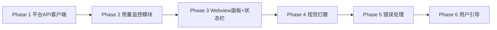

## 一、整体架构设计

v1.0.1 迭代在 v1.0.0 余额监控的基础上，新增 **Token 用量数据统计** 模块。核心目标是在 VSCode 中复刻 DeepSeek 官方用量页面（`platform.deepseek.com/usage`）的核心数据展示能力。

```
v1.0.1 DeepSeek Usage Monitor
├── v1.0.0 已有的模块（保持不动）
│   ├── src/api/client.ts           ← DeepSeekAPIClient（余额查询）
│   ├── src/monitor/balance.ts      ← BalanceMonitor（余额监控+缓存）
│   ├── src/scheduler/scheduler.ts  ← RefreshScheduler（自动刷新调度）
│   ├── src/error/handler.ts        ← APIErrorHandler（错误处理）
│   └── src/extension.ts（部分）    ← StatusBar + 命令注册
│
├── v1.0.1 新增模块
│   ├── src/api/platform.ts   [NEW] ← 平台 API 客户端
│   │   ├── PlatformClient
│   │   │   ├── fetchUsageAmount()    — GET /api/v0/usage/amount
│   │   │   ├── fetchUsageCost()      — GET /api/v0/usage/cost
│   │   │   ├── fetchMonth()          — 同时获取某月用量+费用
│   │   │   └── validate()            — 校验 Token 有效性
│   │   └── 数据处理函数
│   │       ├── sumUsage() / sumChargeable()
│   │       └── formatTokens() / formatCost()
│   │
│   ├── src/monitor/usage.ts   [NEW] ← 用量数据监控+缓存
│   │   ├── UsageMonitor
│   │   │   ├── refresh()             — 自动刷新（走缓存）
│   │   │   ├── forceRefresh()        — 强制刷新
│   │   │   ├── refreshMonth(m,y)     — 按指定月份查询
│   │   │   ├── storeToken()          — 加密存储 Token
│   │   │   └── clearToken()          — 清除 Token
│   │   └── UsageCache 类型
│   │
│   ├── src/webview/           [NEW] ← Webview 面板（酷炫仪表盘）
│   │   ├── panel.ts                  — 面板生命周期管理
│   │   ├── template.ts               — HTML/CSS/JS 模板生成
│   │   └── chart.ts                  — Chart.js 图表配置（导出 JS 代码字符串，内联注入 HTML 模板）
│   │
│   └── src/extension.ts（扩展）     ← 集成 Webview + 状态栏
│       ├── UsageDashboardPanel        — Webview 面板类
│       ├── updateStatusBar()          — 状态栏增加月消费
│       └── setPlatformToken 命令      — 引导用户配置 Token
│
└── 数据流
    └── 用户手动从浏览器复制 Bearer Token → SecretStorage 加密存储
        → PlatformClient 携带 Token 请求平台 API
        → UsageMonitor 缓存到 globalState
        → 点击状态栏 → Webview Panel 渲染酷炫仪表盘
```

### 与 v1.0.0 的关系

- **完全兼容**：不破坏现有余额查询链路，用量模块平行叠加
- **独立认证**：用量数据走独立的 Bearer Token（平台登录凭证），与 API Key（余额查询）互不干扰
- **降级优雅**：Token 未配置或过期时，不影响余额查询和状态栏显示

---

## 二、调研成果

### 2.1 认证方式

DeepSeek 开放平台使用 **Bearer Token 无状态认证**，登录后所有 API 请求通过 `Authorization: Bearer <token>` 头鉴权。

| 属性 | 说明 |
|------|------|
| 认证方式 | Bearer Token（非 Session Cookie） |
| 有效期 | 长期有效，疑似自动续期 |
| 获取方式 | 用户从浏览器 DevTools → Network 中手动复制 |
| 存储方式 | `vscode.ExtensionContext.secrets`（SecretStorage）加密存储 |

### 2.2 平台内部 API 端点

通过浏览器 DevTools 抓包确认了以下核心 API：

| 方法 | 路径 | 参数 | 用途 | 认证 |
|------|------|------|------|------|
| GET | `/api/v0/usage/amount` | `month`、`year` | **当月 Token 用量**（按模型、按天） | ✅ |
| GET | `/api/v0/usage/cost` | `month`、`year` | **当月消费金额**（按模型、按天） | ✅ |
| GET | `/api/v0/users/get_user_summary` | — | 用户汇总信息（辅助，非核心） | ✅ |
| GET | `/auth-api/v0/users/current` | — | 当前用户信息（辅助） | ✅ |

### 2.3 API 响应结构

#### `/api/v0/usage/amount?month=6&year=2026` — Token 用量

响应结构为**双层嵌套**模式：

```typescript
{
    code: 0,
    msg: "",
    data: {
        biz_code: 0,
        biz_msg: "",
        biz_data: {
            total: [                         // 当月各模型汇总
                {
                    model: "deepseek-v4-pro",  // 模型名
                    usage: [
                        { type: "PROMPT_TOKEN", amount: "0" },
                        { type: "PROMPT_CACHE_HIT_TOKEN", amount: "23779840" },
                        { type: "PROMPT_CACHE_MISS_TOKEN", amount: "1240484" },
                        { type: "RESPONSE_TOKEN", amount: "173526" },
                        { type: "REQUEST", amount: "253" }
                    ]
                }
                // ... 更多模型
            ],
            days: [                          // 当月每日明细
                {
                    date: "2026-06-01",
                    data: [ /* 同 total 结构 */ ]
                }
                // ... 整个月的每天数据
            ]
        }
    }
}
```

#### `/api/v0/usage/cost?month=6&year=2026` — 消费金额

结构与 amount 一致，区别：

| 差异点 | amount | cost |
|--------|--------|------|
| `biz_data` 类型 | 对象 `{total, days}` | **数组** `[{total, days, currency}]` |
| amount 单位 | 整数 Token 数 | **浮点数**（元） |
| 额外字段 | 无 | `currency: "CNY"` |

#### 5 种 Usage Type

| type | 含义 | amount 单位 | cost 单位 |
|------|------|-------------|-----------|
| `PROMPT_TOKEN` | Prompt Token 总量 | 个 | 元 |
| `PROMPT_CACHE_HIT_TOKEN` | 缓存命中 | 个 | 元 |
| `PROMPT_CACHE_MISS_TOKEN` | 缓存未命中 | 个 | 元 |
| `RESPONSE_TOKEN` | 输出 Token | 个 | 元 |
| `REQUEST` | 请求次数 | 次 | 元（恒为 0） |

### 2.4 数据映射关系

| 官方页面功能 | 数据来源 | 状态 |
|-------------|----------|------|
| 充值余额（当前总计剩余） | `GET /user/balance`（v1.0.0 已有） | ✅ 已有 |
| 当月消费总金额 | `cost` 接口 → `total` 汇总 | ✅ 可获取 |
| 按天的花费统计 | `cost` 接口 → `days[].data[].usage[]` | ✅ 可获取 |
| 每个模型的 API 调用次数（按天） | `amount` 接口 → `days[].data[][usage.type=REQUEST]` | ✅ 可获取 |
| 每个模型的 Token 使用（按天） | `amount` 接口 → `days[].data[][usage.type=CACHE_HIT/MISS/RESPONSE]` 之和 | ✅ 可获取 |
| 月份筛选联动 | 两个 API 均支持 `month` & `year` 参数 | ✅ 可支持 |

---

## 三、新增文件：`src/api/platform.ts`

### 3.1 类型定义

```typescript
export type UsageType =
  | 'PROMPT_TOKEN'
  | 'PROMPT_CACHE_HIT_TOKEN'
  | 'PROMPT_CACHE_MISS_TOKEN'
  | 'RESPONSE_TOKEN'
  | 'REQUEST';

export interface UsageItem {
  type: UsageType;
  amount: string;
}

export interface ModelUsage {
  model: string;
  usage: UsageItem[];
}

export interface DailyUsage {
  date: string; // YYYY-MM-DD
  data: ModelUsage[];
}

export interface UsageAmountData {
  total: ModelUsage[];
  days: DailyUsage[];
}

export interface UsageCostData {
  total: ModelUsage[];
  days: DailyUsage[];
  currency: string;
}
```

### 3.2 PlatformClient 类

> **注意**：需在文件头部添加 `import { AxiosInstance } from 'axios';`（现有 `axios` 已是运行时依赖，无需额外安装）

```typescript
import axios, { AxiosInstance } from 'axios';

const PLATFORM_BASE = 'https://platform.deepseek.com';
const USER_AGENT = 'DeepSeek-Usage-Monitor/1.0.0';

export class PlatformClient {
  private http: AxiosInstance;

  constructor(token: string) {
    this.http = axios.create({
      baseURL: PLATFORM_BASE,
      headers: {
        'Accept': 'application/json',
        'Authorization': `Bearer ${token}`,
        'X-App-Version': '1.0.0',
        'User-Agent': USER_AGENT,
        'Origin': PLATFORM_BASE,
        'Referer': `${PLATFORM_BASE}/usage`,
      },
    });
  }

  /** 查询某月 Token 用量 */
  async fetchUsageAmount(month: number, year: number): Promise<UsageAmountData | null>;

  /** 查询某月费用 */
  async fetchUsageCost(month: number, year: number): Promise<UsageCostData | null>;

  /** 同时获取某月用量+费用 */
  async fetchMonth(month: number, year: number);

  /** 获取当前月数据（便捷方法） */
  async fetchCurrentMonth();

  /** 校验 Token 是否有效 */
  async validate(): Promise<boolean>;
}
```

**说明**：

- `fetchUsageAmount` 解析嵌套结构 `response.data.data.biz_data`（`response.data` 为 axios 包裹的 JSON 主体，再取 `.data` 字段进入业务层），校验 `code === 0 && biz_code === 0`
- `fetchUsageCost` 特殊处理：`biz_data` 是数组，取 `[0]` 得到 `{ total, days, currency }`
- `validate()` 请求 `GET /api/v0/users/get_user_summary`，仅检查 `code === 0` 不解析业务数据
- 所有方法在 API 返回异常时返回 `null` 而非抛错，由调用方决定降级策略
- 所有请求自动携带 `Authorization: Bearer` 头，无需额外配置

### 3.3 数据处理工具函数

```typescript
/** 从 ModelUsage[] 中汇总某 type 的总和 */
export function sumUsage(data: ModelUsage[], type: UsageType): number;

/**
 * 统计可计费量（缓存命中 + 缓存未命中 + 输出）
 * 注意：amount 接口传入时得到 Token 数，cost 接口传入时得到金额（元），逻辑相同
 */
export function sumChargeable(data: ModelUsage[]): number;

/** 格式化 Token 数为千分位（如 1,234,567） */
export function formatTokens(n: number): string;

/** 格式化费用为 ¥xx.xx */
export function formatCost(n: number): string;
```

---

## 四、新增文件：`src/monitor/usage.ts`

### 4.1 缓存数据类型

```typescript
export interface UsageCache {
  totalTokens: number;           // 当月 Token 总消耗
  totalRequests: number;         // 当月请求总次数
  totalCost: number;             // 当月总费用（元）
  modelBreakdown: Array<{       // 按模型细分
    model: string;
    tokens: number;
    requests: number;
    cost: number;
  }>;
  dailyData: Array<{             // 每日统计
    date: string;
    totalTokens: number;
    totalCost: number;
  }>;
  month: number;                 // 缓存对应的月份
  year: number;                  // 缓存对应的年份
  cachedAt: number;              // 缓存时间戳
}
```

### 4.2 UsageMonitor 类

```typescript
export class UsageMonitor {
  private context: vscode.ExtensionContext;
  private _client: PlatformClient | null = null;
  private _cache: UsageCache | null = null;
  private _hasToken: boolean = false;

  // 注入：Token 过期时由 extension.ts 处理
  onTokenExpired: (() => void) | undefined;

  constructor(context: vscode.ExtensionContext);

  // 读取缓存
  get cachedData(): UsageCache | null;
  get hasToken(): boolean;            // 返回内存中的 Token 状态（仅在 storeToken/clearToken 后可靠）

  // Token 管理（通过 SecretStorage 加密存储）
  async storeToken(token: string): Promise<void>;
  async clearToken(): Promise<void>;

  // 刷新策略
  async refresh(): Promise<UsageCache | null>;          // 自动刷新（缓存 30min 有效则跳过）
  async forceRefresh(): Promise<UsageCache | null>;      // 强制刷新
  async refreshMonth(m: number, y: number): Promise<UsageCache | null>; // 按月份
}
```

**惰性初始化 + Token 状态追踪**：

`context.secrets.get()` 是异步方法，无法在构造函数中同步调用。同时 `get hasToken()` 也无法同步读取 `secrets`。因此采用惰性初始化 + 内存标志位模式：

```typescript
constructor(context: vscode.ExtensionContext) {
  this.context = context;
  this._cache = context.globalState.get<UsageCache | null>('cachedUsageData', null);
  // 不阻塞构造，惰性初始化
  this._initClient();
}

private async _initClient(): Promise<void> {
  const token = await this.context.secrets.get('deepseek.platformToken');
  if (!token) return;
  this._client = new PlatformClient(token);
  this._hasToken = true;
}

// storeToken/clearToken 成功后同步更新内存标志
async storeToken(token: string): Promise<void> {
  await this.context.secrets.store('deepseek.platformToken', token);
  this._client = new PlatformClient(token);
  this._hasToken = true;
}

async clearToken(): Promise<void> {
  await this.context.secrets.delete('deepseek.platformToken');
  this._client = null;
  this._cache = null;
  this._hasToken = false;
}

// 需要 client 时直接从内存变量获取
private _getClient(): PlatformClient | null {
  return this._client;
}
```

> 注意：启动时 `_initClient()` 尚未 resolve 之前，`hasToken` 返回 `false`。但 `storeToken()` 后会立即置为 `true`，不影响运行时体验。

**缓存策略**：

| 条件 | 行为 |
|------|------|
| 当月数据 + 缓存 ≤ 30min | 直接返回缓存，不发起请求 |
| 当月数据 + 缓存 > 30min | 发起请求更新缓存 |
| 非当月数据（历史月份） | 不缓存，每次请求实时获取 |
| 请求失败 | 返回 `null`，UI 降级显示"数据不可用" |

**Token 过期处理**：

`_forceRefresh()` 中 catch 到 401/403 错误时：
1. 通过 `APIErrorHandler.handle()` 弹错误提示（需传入 `source: 'platform'` 区分来源，见下方说明）
2. 触发 `onTokenExpired` 回调（由 `extension.ts` 注入），通知 UI 层引导用户重新配置 Token

> **`APIErrorHandler` 改造说明**：现有 `ErrorHandlerOptions` 只包含 `onRateLimit`，当 BalanceMonitor（API Key）和 UsageMonitor（平台 Token）都遇到 401 时，错误消息不能一概而论。需要在 `ErrorHandlerOptions` 中新增 `source: 'api' | 'platform'` 字段：
> - `source === 'api'`（默认）：弹出"DeepSeek API 认证失败，请检查 API Key 配置"（BalanceMonitor 场景）
> - `source === 'platform'`：弹出"DeepSeek 平台登录凭证已过期，请重新设置平台 Token"（UsageMonitor 场景）

---

## 五、Webview 面板设计

### 5.1 为什么升级到 Webview

VS Code 的 `showInformationMessage` 弹窗仅支持纯文本，无法展示图表、表格、交互控件。而 **Webview Panel** 可以渲染完整的 HTML/CSS/JS 页面，支持：

| 能力 | 弹窗 | Webview Panel |
|------|------|--------------|
| 图表（Chart.js） | ❌ | ✅ |
| 月份下拉联动 | ❌ | ✅ |
| 表格精确排版 | ❌ | ✅ CSS Grid |
| 展开/收起交互 | ❌ | ✅ |
| 一键复制 | ❌ | ✅ |
| 深色/浅色主题自适应 | 基本 | ✅ CSS 变量 |

### 5.2 视觉风格设计

整体采用**深色工具台风格**（类似 VS Code 内置终端/调试控制台），但比终端更精致：

```
┌────────────────────────────────────────────────────────────┐
│  DeepSeek 用量仪表盘         2026年6月  [▼]  [↻]  [⚙]   │
├────────────────────────────────────────────────────────────┤
│  ┌──────────┐  ┌──────────┐  ┌──────────┐  ┌──────────┐ │
│  │   💰 余额  │  │  📊 月消费 │  │  📦 Token  │  │  🔄 请求  │ │
│  │  ¥88.88  │  │  ¥12.50  │  │ 12,345,678│  │  1,115   │ │
│  └──────────┘  └──────────┘  └──────────┘  └──────────┘ │
│                                                            │
│  📈 每日 Token 消耗趋势                                    │
│  ╭──────────────────────────────────────────────────╮     │
│  │           Chart.js 柱状图                          │     │
│  │  ██                                              │     │
│  │  ██ ██                                           │     │
│  │  ██ ██ ██                                        │     │
│  │  ██ ██ ██ ██    ██                               │     │
│  │  ██ ██ ██ ██ ██ ██ ██ ██                         │     │
│  │  06/01  06/05  06/09  06/13                       │     │
│  ╰──────────────────────────────────────────────────╯     │
│                                                            │
│  📋 模型用量明细                                          │
│  ┌──────────────────────────────────────────────────┐     │
│  │  模型          │  Token     │  请求  │  费用     │     │
│  ├──────────────────────────────────────────────────┤     │
│  │  ▸ deepseek-v4-pro │ 1,234,567 │  253  │  ¥5.36  │     │
│  │  ▸ deepseek-v4-flash│11,111,111│  862  │  ¥7.14  │     │
│  └──────────────────────────────────────────────────┘     │
│                                                            │
│  📅 每日明细（点击展开）                                   │
│  [+] 2026-06-12  v4-pro: ¥2.18  v4-flash: ¥0.94          │
│  [+] 2026-06-13  v4-flash: ¥0.97                          │
│                                                            │
│  ⚡ 数据每 30 分钟自动刷新  |  上次更新: 14:32:15         │
└────────────────────────────────────────────────────────────┘
```

**视觉设计要点**：

| 要素 | 实现方式 |
|------|----------|
| 深色背景 | `background: var(--vscode-editor-background)` 自动适配主题 |
| 卡片式信息块 | `border-radius: 8px; background: rgba(255,255,255,0.04); border: 1px solid rgba(255,255,255,0.08)` |
| 统计数字高亮 | `font-size: 24px; font-weight: 700; font-variant-numeric: tabular-nums` |
| 图表 | Chart.js 柱状图，渐变填充色 `#6C5CE7 → #A29BFE` |
| 分隔线 | 微妙渐变线 `linear-gradient(90deg, transparent, rgba(255,255,255,0.1), transparent)` |
| 动画 | 卡片加载时 `fadeInUp` 轻微动画（300ms） |
| 图标 | SVG 内联图标或 Unicode Emoji（`$(rocket)` 等 codicon 语法仅在 statusBar 可用，Webview 中需使用 SVG/Emoji） |
| 表格 | CSS Grid 布局，hover 行高亮 |
| 交互 | 模型行可点击展开每日详情；月份下拉即时切换 |

### 5.3 Webview 面板类

新增 `src/webview/panel.ts`：

```typescript
import * as vscode from 'vscode';
import { UsageMonitor, UsageCache } from '../monitor/usage';
import { BalanceMonitor } from '../monitor/balance';
import { generateHTML } from './template';

export class UsageDashboardPanel {
  public static currentPanel: UsageDashboardPanel | undefined;
  private readonly _panel: vscode.WebviewPanel;
  private _disposables: vscode.Disposable[] = [];
  private _currentMonth: number;         // 面板当前选中的月份
  private _currentYear: number;          // 面板当前选中的年份

  private constructor(
    panel: vscode.WebviewPanel,
    private balanceMonitor: BalanceMonitor,
    private usageMonitor: UsageMonitor,
  ) {
    this._panel = panel;
    const now = new Date();
    this._currentMonth = now.getMonth() + 1;
    this._currentYear = now.getFullYear();
    this._panel.onDidDispose(() => this.dispose(), null, this._disposables);
    this._panel.webview.onDidReceiveMessage(
      async (msg) => {
        switch (msg.command) {
          case 'refresh':
            await this._refresh();
            break;
          case 'changeMonth':
            await this._refreshMonth(msg.month, msg.year);
            break;
          case 'copy':
            vscode.env.clipboard.writeText(msg.text);
            break;
        }
      },
      null,
      this._disposables,
    );
    this._render();
  }

  static async createOrShow(
    context: vscode.ExtensionContext,
    balanceMonitor: BalanceMonitor,
    usageMonitor: UsageMonitor,
  ) {
    // 打开面板前先同步刷新一次数据
    await balanceMonitor.forceRefreshBalance();
    await usageMonitor.forceRefresh();
    const column = vscode.window.activeTextEditor?.viewColumn || vscode.ViewColumn.One;

    if (UsageDashboardPanel.currentPanel) {
      UsageDashboardPanel.currentPanel._panel.reveal(column);
      await UsageDashboardPanel.currentPanel._refresh();
      return;
    }

    const panel = vscode.window.createWebviewPanel(
      'deepseekUsageDashboard',
      'DeepSeek 用量仪表盘',
      column,
      {
        enableScripts: true,
        // localResourceRoots 用于加载本地资源，当前模板完全内联生成无需设置
        // 保留空数组确保安全（默认拒绝所有本地文件访问）
        localResourceRoots: [],
      },
    );

    UsageDashboardPanel.currentPanel = new UsageDashboardPanel(
      panel,
      balanceMonitor,
      usageMonitor,
    );
  }

  /** 对外暴露：供 scheduler 回调调用，刷新面板数据（余额+用量同步更新） */
  public async refreshView(): Promise<void> {
    // scheduler 已触发 balanceMonitor.refreshBalance() + usageMonitor.refresh()
    // 直接从缓存读取最新值
    await this._render();
  }

  private async _refresh() {
    await this.balanceMonitor.forceRefreshBalance();  // 确保余额最新
    await this.usageMonitor.forceRefresh();            // 确保用量最新
    await this._render();
  }

  private async _refreshMonth(m: number, y: number) {
    this._currentMonth = m;
    this._currentYear = y;
    await this.usageMonitor.refreshMonth(m, y);
    await this._render();
  }

  private async _render() {
    const balance = this.balanceMonitor.currentBalance;
    const usage = this.usageMonitor.cachedData;
    this._panel.webview.html = generateHTML({
      balance,
      usage,
      month: this._currentMonth,
      year: this._currentYear,
    });
  }

  public dispose() {
    UsageDashboardPanel.currentPanel = undefined;
    this._panel.dispose();
    while (this._disposables.length) {
      const d = this._disposables.pop();
      if (d) d.dispose();
    }
  }
}
```

### 5.4 HTML 模板

新增 `src/webview/template.ts`，核心是生成包含 Chart.js + 深色仪表盘的完整 HTML。模板包含：

```typescript
export function generateHTML(data: {
  balance: number;
  usage: UsageCache | null;
  month: number;
  year: number;
}): string {
  return `<!DOCTYPE html>
<html lang="zh-CN">
<head>
  <meta charset="UTF-8">
  <meta name="viewport" content="width=device-width, initial-scale=1.0">
  <meta http-equiv="Content-Security-Policy" 
        content="default-src 'none'; style-src 'unsafe-inline'; 
                 script-src 'unsafe-inline' https://cdn.jsdelivr.net; 
                 font-src 'self' https://cdn.jsdelivr.net;
                 img-src 'self' data:;">
  <script src="https://cdn.jsdelivr.net/npm/chart.js@4.4.0/dist/chart.umd.min.js"></script>
  <style>
    /* 深色工具台风格样式 */
    body { ... }
    .card { ... }
    .stat-value { ... }
    .chart-container { ... }
    table { ... }
  </style>
</head>
<body>
  <!-- 仪表盘本体 -->
  <script>
    // Chart.js 图表初始化
    // 消息通信: vscode.postMessage({ command: 'refresh' })
  </script>
</body>
</html>`;
}
```

**设计要点**：

- `chart.ts` 导出生成 Chart.js 初始化 JS 代码的字符串函数，`template.ts` 将其拼接进 HTML 模板的 `<script>` 块中
- 不能直接 `import` chart 模块到 Webview，因为 Webview 运行在浏览器隔离环境，插件代码运行在 Node.js 环境——两者不通
- 所有 Webview 中执行的 JS 代码必须作为字符串嵌入 HTML

**CSP 策略**：只允许 `cdn.jsdelivr.net` 加载 Chart.js 字体，走 CDN 避免打包进插件。

### 5.5 Webview ↔ Extension 通信协议

| 方向 | 消息 | 说明 |
|------|------|------|
| Webview → Extension | `{ command: 'refresh' }` | 用户点击刷新按钮 |
| Webview → Extension | `{ command: 'changeMonth', month, year }` | 切换月份联动 |
| Webview → Extension | `{ command: 'copy', text }` | 复制文本到剪贴板 |
| Extension → Webview | `{ command: 'update', data: {...} }` | 推送更新后的数据 |

### 5.6 状态栏展示

`updateStatusBar()` 改造：

- **Token 已配置 + 数据有效**：在余额后追加 ` | ¥x.xx`（月消费简写）
- **未配置**：仅显示余额
- **点击状态栏**：打开 Webview Panel（不再是弹窗）
- **hover 状态栏**：Tooltip 提示当前缺失的配置项（API Key / Token），指引用户通过命令面板配置

```
改造前：$(rocket) DeepSeek: ¥88.88
改造后：$(rocket) DeepSeek: ¥88.88 | ¥12.50
```

状态栏绑定 `deepseek-usage.showUsage` 命令，点击时打开 Webview Panel。**原有的 `showUsage` 命令注册需替换为新实现**（不能与旧弹窗实现共存）：

```typescript
// 状态栏点击指向打开仪表盘命令
statusBarItem.command = 'deepseek-usage.showUsage';
statusBarItem.tooltip = '点击打开用量仪表盘';

// 注册命令：打开 Webview 面板（替换旧的弹窗实现）
// 注意：context.subscriptions 中只能有一个 'deepseek-usage.showUsage' 注册
context.subscriptions.push(
  vscode.commands.registerCommand('deepseek-usage.showUsage', () => {
    UsageDashboardPanel.createOrShow(context, balanceMonitor, usageMonitor);
  }),
);
```

> **为什么不能同时存在？** `vscode.commands.registerCommand` 多次注册同一命令名时，只有最后一次生效。旧版 `showUsage` 的弹窗实现（`showUsageDetails`）在新版中已被 Webview 面板取代，`showUsageDetails` 函数本身可以移除或保留但不再被命令调用。

### 5.7 首次激活两步向导

插件首次激活时（通过 `globalState` 标记 `hasShownWelcome` 判断），弹出引导对话框，引导用户完成两步配置：

```
┌─────────────────────────────────────────────────────────────┐
│  🔑 欢迎使用 DeepSeek Usage Monitor                        │
│                                                             │
│  要查看余额用量统计，请先完成两步配置：                      │
│                                                             │
│  Step 1: 配置 API Key（用于查询账户余额）                   │
│  从 platform.deepseek.com/api_keys 复制你的 API Key         │
│                    [配置 API Key]                            │
│                                                             │
│  Step 2: 配置平台 Token（用于查询 Token 用量统计）          │
│  登录 platform.deepseek.com → F12 → Network →              │
│  复制任意请求 authorization 头的 Bearer 值                  │
│                    [配置 Token]                              │
│                                                             │
│  两部分相互独立，任一步骤跳过不影响另一功能                   │
│                    [开始使用]                                │
└─────────────────────────────────────────────────────────────┘
```

**实现方式**：

```typescript
// extension.ts → activate() 中
const hasShownWelcome = context.globalState.get<boolean>('hasShownWelcome', false);
if (!hasShownWelcome) {
    await context.globalState.update('hasShownWelcome', true);
    const action = await vscode.window.showInformationMessage(
        '🔑 DeepSeek Usage Monitor：需配置 API Key 查余额 + 平台 Token 查用量统计',
        '配置 API Key',
        '配置 Token',
        '知道了'
    );
    if (action === '配置 API Key') {
        vscode.commands.executeCommand('workbench.action.openSettings', 'deepseek.apiKey');
    } else if (action === '配置 Token') {
        vscode.commands.executeCommand('deepseek-usage.setPlatformToken');
    }
}
```

> **说明**：引导只弹出一次。用户后续可通过命令面板随时配置或修改。

**静默降级规则**：

| 状态 | 状态栏 | 仪表盘 |
|------|--------|--------|
| 仅配 API Key | 显示余额 | 仅余额，用量显示「暂无数据」 |
| 仅配 Token | 仅月消费 | Token 数据正常，余额为 0 |
| 两者均未配 | 显示 `未配置` | 引导提示配 Token |
| 两者均配 | 余额 + 月消费 | 全部数据正常 |

### 5.8 RefreshScheduler 协同刷新

当 scheduler 定时器触发刷新时，需要先同步数据再更新所有 UI 表面：

```typescript
const refreshCallback = async () => {
    // Step 1: 先刷新数据（各自内部判断缓存是否过期）
    await balanceMonitor.refreshBalance();
    await usageMonitor.refresh();
    
    // Step 2: 更新状态栏（用最新数据）
    await updateStatusBar(balanceMonitor, usageMonitor);
    
    // Step 3: 如果面板已打开，同步更新面板视图
    if (UsageDashboardPanel.currentPanel) {
        UsageDashboardPanel.currentPanel.refreshView();
    }
};
```

> **为什么不在 `updateStatusBar` 内部刷新？** `updateStatusBar` 只负责用已有数据展示 UI，不应承担数据刷新职责。数据刷新放在回调函数顶层，职责清晰、便于维护。

**刷新协同机制**：

| 模块 | 缓存 TTL | 触发条件 | 失败降级 |
|------|----------|----------|----------|
| 余额 | 5 分钟（可配置） | scheduler 定时 + 手动刷新 + 打开面板 | 显示旧缓存 |
| 用量 | 30 分钟（硬编码） | scheduler 定时 + 手动刷新 + 打开面板 + 切换月份 | 显示「暂无数据」|  

两者共用同一个 scheduler 定时器（默认 30 分钟），各自的 `refresh()` 方法内部独立判断缓存是否过期，不会造成重复请求。

### 5.9 配置变更自动刷新

当用户在 `settings.json` 中修改 `deepseek.apiKey` 时，需自动检测并刷新状态栏：

```typescript
// extension.ts → onDidChangeConfiguration 中补充
context.subscriptions.push(
    vscode.workspace.onDidChangeConfiguration(async (event) => {
        if (event.affectsConfiguration('deepseek.autoRefreshInterval')) {
            const newInterval = vscode.workspace.getConfiguration('deepseek')
                .get('autoRefreshInterval', 30);
            scheduler?.updateInterval(newInterval);
        }
        
        // API Key 变更时自动刷新状态栏
        if (event.affectsConfiguration('deepseek.apiKey')) {
            await updateStatusBar(balanceMonitor, usageMonitor);
        }
    })
);
```

**Platform Token 的修改监听**：Token 通过 `context.secrets` 加密存储，不经过 `settings.json`，因此用户在命令面板中「设置平台 Token」时已自动触发 `forceRefresh`，无需额外监听。

### 5.10 deactivate() 清理

插件停用时需清理 scheduler 定时器和 Webview 面板资源：

```typescript
export function deactivate() {
    scheduler?.stop();
    // 如果面板打开，关闭面板（自动触发 panel.dispose()）
    UsageDashboardPanel.currentPanel?.dispose();
}
```

> `UsageDashboardPanel` 的 `dispose()` 方法内部已处理 `currentPanel = undefined` 和 `_panel.dispose()`，不会产生悬空引用。

---

## 六、package.json 配置变更

### 6.1 配置项说明

**不新增** `configuration.properties` 项。平台 Token 通过 `context.secrets`（SecretStorage）加密存储，不由 `settings.json` 管理。

> **为什么？** 若在 `configuration.properties` 中声明 `deepseek.platformToken` 字段，它会在 VSCode 设置 UI 中暴露为一个文本输入框，但用户在该输入框中设置的值走的是 `settings.json`，而非 `SecretStorage`。这会造​​成"设置了但插件读不到"的困惑。Token 应仅通过命令面板的引导流程设置，确保写入加密存储。

### 6.2 新增命令

```json
// contributes.commands 新增
{
    "command": "deepseek-usage.setPlatformToken",
    "title": "DeepSeek: 设置平台 Token（用量统计）"
},
{
    "command": "deepseek-usage.clearPlatformToken",
    "title": "DeepSeek: 清除平台 Token"
}
```

---

## 七、数据持久化方案

| 键名 | 类型 | 存储方式 | 说明 |
|------|------|----------|------|
| `deepseek.platformToken` | `string` | `context.secrets`（系统密钥链） | Bearer Token，加密存储 |
| `cachedUsageData` | `UsageCache` | `context.globalState` | 用量数据缓存，JSON 序列化 |

**为什么 Token 用 SecretStorage 而非 globalState？**

`globalState` 以明文 JSON 存储在磁盘 `globalState.json` 中，不安全。`SecretStorage` 由 VSCode 底层调用系统密钥链（macOS Keychain / Windows Credential Vault / Linux libsecret）加密存储，适合保存凭证类敏感数据。

---

## 八、运营注意事项

### 8.1 Token 安全

- Token 通过 `context.secrets` 加密存储，不暴露在 `settings.json` 中
- 用户可在命令面板中随时「清除平台 Token」
- Token 在运行时存在于内存中，插件 deactivate 时主动置空

### 8.2 平台 API 稳定性

- DeepSeek 平台内部 API 无官方文档，可能随前端更新而变化
- 响应结构变更时插件降级为不显示用量数据，不影响余额查询
- 关键路径（金额/用量字段名）如有变化需手动适配

### 8.3 缓存策略

- Token 用量缓存 TTL 为 30 分钟（比余额 5 分钟长，因为用量数据变化不频繁）
- 当前月数据缓存，历史月份实时请求
- 每次 VSCode 启动时加载缓存，启动后首次请求时更新

### 8.4 月份切换

- 默认显示当前月份
- 后续可通过新增命令 `deepseek-usage.showMonth` 让用户输入年份月份
- 历史月份数据不缓存，每次都请求 API

### 8.5 余额扣费规则

- 扣费时优先扣除赠送余额（`granted_balance`），不足时扣除充值余额（`topped_up_balance`）
- cost 接口返回的金额已包含所有费用，无需插件侧计算

---

## 九、开发计划

### Phase 1：平台 API 客户端（预计 0.5 天）

**目标**：完成平台 API 的封装和数据结构定义。

| # | 任务 | 涉及文件 | 产出/验收标准 |
|---|------|----------|--------------|
| 1.1 | 定义 `UsageType`、`UsageItem`、`ModelUsage`、`DailyUsage` 等类型 | `src/api/platform.ts` | 类型定义完整，与官方 API 响应结构一致 |
| 1.2 | 定义 `UsageAmountData`、`UsageCostData` 数据类型 | `src/api/platform.ts` | 映射两层嵌套（`data.biz_data`）结构 |
| 1.3 | 实现 `PlatformClient` 类 — 构造函数 + `fetchUsageAmount()` | `src/api/platform.ts` | 带 Bearer Token + 自定义 UA/Origin/Referer 头；解析嵌套结构取 `biz_data` |
| 1.4 | 实现 `PlatformClient.fetchUsageCost()` | `src/api/platform.ts` | 注意 `biz_data` 是数组，取 `[0]` |
| 1.5 | 实现 `PlatformClient.fetchMonth()` / `fetchCurrentMonth()` | `src/api/platform.ts` | 同时请求 amount + cost |
| 1.6 | 实现 `PlatformClient.validate()` | `src/api/platform.ts` | 轻量请求 `get_user_summary` |
| 1.7 | 实现数据处理工具函数（`sumUsage`、`sumChargeable`、`formatTokens`、`formatCost`） | `src/api/platform.ts` | `sumUsage` 按类型汇总；`sumChargeable` 计算可计费 3 类之和（通用 amount/cost）；格式化函数可读性好 |
| 1.8 | **验证**：单元测试或手动调用 | 临时测试脚本 | 持有效 Token 调用返回正确数据；无效 Token 返回 `null` |

**里程碑**：平台 API 客户端可独立工作，不依赖 VSCode UI。

---

### Phase 2：用量数据监控模块（预计 0.5 天）

**目标**：实现用量数据的获取、缓存和 Token 管理。

| # | 任务 | 涉及文件 | 产出/验收标准 |
|---|------|----------|--------------|
| 2.1 | 定义 `UsageCache` 缓存类型 | `src/monitor/usage.ts` | 包含 `totalTokens`、`totalRequests`、`totalCost`、`modelBreakdown`、`dailyData` |
| 2.2 | 实现 `UsageMonitor` 构造函数 + 惰性初始化 `_initClient()` | `src/monitor/usage.ts` | 启动时从 `globalState` 恢复缓存；构造函数调用 `_initClient()` 异步读取 `secrets` 初始化 `_client`，不阻塞构造流程 |
| 2.3 | 实现 `storeToken()` / `clearToken()` | `src/monitor/usage.ts` | 通过 `context.secrets` 加密存储 |
| 2.4 | 实现 `refresh()`（自动刷新，走缓存） | `src/monitor/usage.ts` | 缓存 30 分钟内有效则跳过请求 |
| 2.5 | 实现 `forceRefresh()`（强制请求） | `src/monitor/usage.ts` | 异常时触发 `onTokenExpired` 回调 |
| 2.6 | 实现 `refreshMonth()`（按月份查询） | `src/monitor/usage.ts` | 当前月走缓存，历史月实时请求 |
| 2.7 | 实现数据构建方法 `_buildCache()` | `src/monitor/usage.ts` | 将 API 原始数据转换为 `UsageCache`，写入 `globalState` |
| 2.8 | **验证**：调用全链路 | F5 调试 | Token 有效时获取正确用量数据；Token 过期优雅降级 |

**里程碑**：用量数据可获取、缓存、恢复，不依赖 UI。

---

### Phase 3：Webview 面板 + 状态栏集成（预计 1.5 天）

**目标**：将用量数据展示到 Webview 仪表盘和状态栏。

| # | 任务 | 涉及文件 | 产出/验收标准 |
|---|------|----------|--------------|
| 3.1 | 在 `activate()` 中实例化 `UsageMonitor`，注入 `onTokenExpired` 回调 | `src/extension.ts` | Token 过期时弹警告引导用户重新配置 |
| 3.2 | 注册 `deepseek-usage.setPlatformToken` 命令 | `src/extension.ts` | 输入框引导用户粘贴 Token，保存后自动刷新 |
| 3.3 | 注册 `deepseek-usage.clearPlatformToken` 命令 | `src/extension.ts` | 清除 storage 中的 Token |
| 3.4 | 实现 `UsageDashboardPanel` 面板类（创建/销毁/消息处理） | `src/webview/panel.ts` | 面板可打开、关闭、接收 Webview 消息 |
| 3.5 | 替换 `deepseek-usage.showUsage` 命令实现 | `src/extension.ts` | 移除旧弹窗实现，改为打开 Webview Panel |
| 3.6 | 实现 Webview HTML 模板 + 深色仪表盘 CSS | `src/webview/template.ts` | 渲染 4 个统计卡片 + 模型明细表格 + 更新时间戳 |
| 3.7 | 集成 Chart.js 柱状图展示每日 Token 消耗趋势 | `src/webview/chart.ts` + `template.ts` | 有数据日期的柱状图，渐变填充色，自动适配深色主题 |
| 3.8 | 实现月份下拉切换联动 + 一键复制功能 | `src/webview/template.ts` + `panel.ts` | 切换月份时重新请求数据并刷新图表 |
| 3.9 | 改造 `updateStatusBar()` — 追加月消费金额 + 绑定点击打开面板 | `src/extension.ts` | 状态栏显示 `$(rocket) DeepSeek: ¥88.88 | ¥12.50`，点击打开 Webview 面板 |
| 3.10 | 改造 `deactivate()` + 面板资源释放 | `src/extension.ts` | 面板关闭时清理 Webview 资源，插件停用时释放 `UsageMonitor` |
| 3.11 | 新增 `package.json` 命令定义 | `package.json` | 注册 `setPlatformToken`、`clearPlatformToken`、`showUsage` 命令 |
| 3.12 | **验证**：F5 启动全链路 | 全部文件 | 配置 Token → 状态栏显示 → 点击打开仪表盘 → 图表/表格/月份切换 OK |

**里程碑**：插件完整功能可用，含酷炫 Webview 仪表盘。

---

### Phase 4：Webview 视觉打磨与动画效果（预计 0.5 天）

**目标**：让仪表盘看起来更酷——动画、微交互、空状态占位。

| # | 任务 | 涉及文件 | 产出/验收标准 |
|---|------|----------|--------------|
| 4.1 | 添加卡片入场动画（fadeInUp 300ms） | `src/webview/template.ts` | 打开面板时卡片依次淡入上移 |
| 4.2 | 图表 Tooltip 样式优化（圆角、阴影、深色背景） | `src/webview/template.ts` | 鼠标悬停柱状图显示精确数值 |
| 4.3 | 空数据/加载中/错误状态占位 | `src/webview/template.ts` | Token 未配置时显示引导提示；无数据时显示「暂无数据」 |
| 4.4 | 一键复制按钮动画反馈 | `src/webview/template.ts` + `panel.ts` | 点击复制后按钮闪烁「已复制」提示 |
| 4.5 | 响应式布局适配（窄屏/宽屏） | `src/webview/template.ts` | 面板宽度变化时卡片自动换行 |
| 4.6 | **验证**：视觉走查 | F5 调试 | 动画流畅、无布局错位、深色主题一致 |

**里程碑**：仪表盘达到可发布视觉品质。

---

### Phase 5：错误处理与健壮性（预计 0.5 天）

**目标**：覆盖所有异常路径。

| # | 任务 | 涉及文件 | 产出/验收标准 |
|---|------|----------|--------------|
| 5.1 | Token 无效/过期 → 弹警告引导重新配置 | `src/extension.ts` | 接到 `onTokenExpired` 回调后弹窗 |
| 5.2 | 网络错误 → 静默降级，不影响余额展示 | `src/monitor/usage.ts` | 用量请求异常返回 `null`，UI 层判断 |
| 5.3 | 平台 API 结构变更 → 返回 `null` 不崩溃 | `src/api/platform.ts` | 所有解析路径有防御性判空 |
| 5.4 | Token 未配置 → 用量模块不可用，无错误弹窗 | `src/extension.ts` | 静默，用户可通过命令面板配置 |
| 5.5 | 快速连续请求 → 缓存拦截避免频繁调用 | `src/monitor/usage.ts` | `refresh()` 最多每 30min 请求一次 |
| 5.6 | **验证**：极端场景覆盖 | 全部文件 | 清空 Token → 用量区域消失；断网 → 显示旧缓存或无数据；API 返回异常结构 → 不显示 |

**里程碑**：所有异常路径有兜底处理，插件零崩溃。

---

### Phase 6：用户引导与体验优化（预计 0.5 天）

**目标**：降低新用户上手门槛，提升配置体验。

| # | 任务 | 涉及文件 | 产出/验收标准 |
|---|------|----------|--------------|
| 6.1 | 实现首次激活两步向导（API Key + Token） | `src/extension.ts` | 首次激活弹窗引导用户配置；`hasShownWelcome` 标记只弹一次 |
| 6.2 | `onDidChangeConfiguration` 监听 `deepseek.apiKey` 变更自动刷新 | `src/extension.ts` | 修改 API Key 后状态栏立即刷新，无需手动点刷新 |
| 6.3 | 状态栏 Tooltip 显示缺失配置提示 | `src/extension.ts` | hover 状态栏时提示当前缺失项（API Key / Token） |
| 6.4 | 空 Dashboard 时覆盖 Token 未配置引导提示 | `src/webview/template.ts` | 仪表盘无数据时显示清晰的引导文字引导用户配置 Token |
| 6.5 | **验证**：F5 启动全链路 | 全部文件 | 首次启动弹向导 → 跳过 → 状态栏显示「未配置」→ 配完 Key → 显示余额 → 配完 Token → 显示用量 |

**里程碑**：零配置障碍，新用户 2 步完成设置。

---

### 依赖关系图



> **预估总工时**：约 4 天（单人开发）
> **工时变动说明**：从弹窗方案升级到 Webview Panel 方案增加了约 1.5 天工作量，主要用于 HTML/CSS/JS 模板编写、Chart.js 图表集成、面板生命周期管理。后端数据层（Phase 1/2）不受影响。
>
> **说明**：由于数据链路已经调研完毕、API 结构已确认、TypeScript 类型可直接参照官方 Response JSON 编写，无需猜测和调试，预计开发效率较高。

---

## 十、数据流全景

```
┌──────────────────────────────────────────────────────────────┐
│                    用户操作层                                  │
│  ① 登录 platform.deepseek.com                                │
│  ② F12 → Network → 复制 authorization 头的值                │
│  ③ 在 VSCode 中执行「DeepSeek: 设置平台 Token」              │
└──────────────────────┬───────────────────────────────────────┘
                       │ Bearer Token
                       ▼
┌──────────────────────────────────────────────────────────────┐
│                    加密存储层                                  │
│  context.secrets.store('deepseek.platformToken', token)      │
│  → macOS Keychain / Windows Credential Vault                 │
└──────────────────────┬───────────────────────────────────────┘
                       │ 运行时读取
                       ▼
┌──────────────────────────────────────────────────────────────┐
│                    API 请求层                                  │
│  PlatformClient                                               │
│  ├── fetchUsageAmount(month, year)                            │
│  │   → GET /api/v0/usage/amount?month=6&year=2026            │
│  │   ← { total, days }                                       │
│  └── fetchUsageCost(month, year)                              │
│      → GET /api/v0/usage/cost?month=6&year=2026              │
│      ← [{ total, days, currency }]                            │
└──────────────────────┬───────────────────────────────────────┘
                       │ 原始数据
                       ▼
┌──────────────────────────────────────────────────────────────┐
│                    数据处理层                                  │
│  UsageMonitor._buildCache()                                   │
│  ├── totalTokens = sumChargeable(amount.total)               │
│  ├── totalRequests = sumUsage(amount.total, 'REQUEST')       │
│  ├── totalCost = sumChargeable(cost.total)                   │
│  ├── modelBreakdown: 按模型拆解 Token/请求/费用              │
│  └── dailyData: 按天拆解 Token/费用                          │
└──────────────────────┬───────────────────────────────────────┘
                       │ UsageCache
                       ▼
┌──────────────────────────────────────────────────────────────┐
│                    UI 展示层                                   │
│  ┌─────────────────────────────────────────────────────┐     │
│  │ 状态栏: $(rocket) DeepSeek: ¥88.88 | ¥12.50        │     │
│  │         (点击打开仪表盘)                           │     │
│  └──────────────────┬──────────────────────────────────┘     │
│                     ↓ 点击状态栏                              │
│  ┌─────────────────────────────────────────────────────┐     │
│  │  Webview Panel: DeepSeek 用量仪表盘                  │     │
│  │                                                     │     │
│  │  ┌──────┐ ┌──────┐ ┌──────┐ ┌──────┐               │     │
│  │  │¥88.88│ │¥12.50│ │12.3M │ │1,115 │               │     │
│  │  │余额  │ │月消费 │ │Token │ │请求  │               │     │
│  │  └──────┘ └──────┘ └──────┘ └──────┘               │     │
│  │                                                     │     │
│  │  📈 每日消耗趋势 (Chart.js 柱状图)                  │     │
│  │  ╭──────────────────────────────────────────╮      │     │
│  │  │           ██                               │      │     │
│  │  │     ██    ██ ██      ██                    │      │     │
│  │  │  ██ ██ ██ ██ ██ ██ ██ ██ ██                │      │     │
│  │  ╰──────────────────────────────────────────╯      │     │
│  │                                                     │     │
│  │  📋 模型用量明细 (可点击展开日详情)                │     │
│  │  ┌──────────────────────────────────────────┐      │     │
│  │  │ v4-pro     1,234,567   253   ¥5.36      │      │     │
│  │  │ v4-flash  11,111,111   862   ¥7.14      │      │     │
│  │  └──────────────────────────────────────────┘      │     │
│  │                                                     │     │
│  │  ⚡ 数据每30min刷新 | 上次: 14:32                  │     │
│  └─────────────────────────────────────────────────────┘     │
└──────────────────────────────────────────────────────────────┘
```

---

## 十一、注意事项

1. **Token 与 API Key 的区别**：`deepseek.apiKey` 用于余额查询（走官方 API），`deepseek.platformToken` 用于用量统计（走平台内部 API），两者用途不同、互不影响。

2. **Token 有效期**：目前观察到平台登录凭证长期有效甚至自动续期，但 Token 仍有理论上过期的可能。插件会检测 401 并引导用户重新配置。

3. **平台 API 无官方文档**：用量/费用接口是平台前端内部 API，DeepSeek 未公开发布文档。如未来平台改版导致接口路径或响应结构变化，需要手动适配。

4. **数据延迟**：用量数据可能有几分钟到几小时的延迟（取决于平台后台统计系统的更新频率），非实时数据。

5. **隐私保护**：Token 通过 `SecretStorage` 加密存储，不会出现在 `settings.json` 中。用户可随时清除 Token。

6. **API 错误区分**：`APIErrorHandler` 的 `ErrorHandlerOptions` 需新增 `source: 'api' | 'platform'` 字段，用于区分 API Key 认证失败和平台 Token 过期两种 401 场景，显示不同的提示消息和引导按钮。

7. **刷新协同**：余额和用量共用同一个 `RefreshScheduler` 定时器（默认 30 分钟），各自的 `refresh()` 方法内部独立判断缓存是否过期（余额 5 分钟，用量 30 分钟），不会造成重复请求。手动刷新时两者同时强制刷新。
