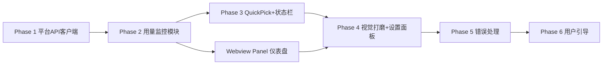

## 一、整体架构设计

v1.0.1 迭代在 v1.0.0 余额监控的基础上，新增 **Token 用量数据统计** 模块。核心目标是在 VSCode 中复刻 DeepSeek 官方用量页面（`platform.deepseek.com/usage`）的核心数据展示能力。

```
v1.0.1 DeepSeek Usage Monitor
├── v1.0.0 已有的模块（保持不动）
│   ├── src/api/client.ts           ← DeepSeekAPIClient（余额查询）
│   ├── src/monitor/balance.ts      ← BalanceMonitor（余额监控+缓存）
│   ├── src/scheduler/scheduler.ts  ← RefreshScheduler（自动刷新调度）
│   ├── src/error/handler.ts        ← APIErrorHandler（错误处理）
│   └── src/extension.ts（部分）    ← StatusBar + 命令注册
│
├── v1.0.1 新增模块
│   ├── src/api/platform.ts   [NEW] ← 平台 API 客户端
│   │   ├── PlatformClient
│   │   │   ├── fetchUsageAmount()    — GET /api/v0/usage/amount
│   │   │   ├── fetchUsageCost()      — GET /api/v0/usage/cost
│   │   │   ├── fetchMonth()          — 同时获取某月用量+费用
│   │   │   └── validate()            — 校验 Token 有效性
│   │   └── 数据处理函数
│   │       ├── sumUsage() / sumChargeable()
│   │       └── formatTokens() / formatCost()
│   │
│   ├── src/monitor/usage.ts   [NEW] ← 用量数据监控+缓存
│   │   ├── UsageMonitor
│   │   │   ├── refresh()             — 自动刷新（走缓存）
│   │   │   ├── forceRefresh()        — 强制刷新
│   │   │   ├── refreshMonth(m,y)     — 按指定月份查询
│   │   │   ├── storeToken()          — 加密存储 Token
│   │   │   └── clearToken()          — 清除 Token
│   │   └── UsageCache 类型
│   │
│   ├── src/webview/           [NEW] ← Webview 面板（完整仪表盘）
│   │   ├── panel.ts                  — 面板生命周期管理 + 设置消息处理
│   │   ├── template.ts               — HTML/CSS/JS 模板生成（含设置面板）
│   │   └── chart.ts                  — Chart.js 图表配置（导出 JS 代码字符串，内联注入 HTML 模板）
│   │
│   └── src/extension.ts（扩展）     ← 集成 QuickPick + 状态栏
│       ├── showQuickPick()            — QuickPick 悬浮面板
│       ├── updateStatusBar()          — 状态栏增加月消费
│       ├── setPlatformToken 命令      — 引导用户配置 Token
│       ├── openDashboard 命令         — 打开 Webview Panel 仪表盘
│       └── _fmt()                     — 大数格式化（万/亿）
│
└── 数据流
    └── 用户手动从浏览器复制 Bearer Token → SecretStorage 加密存储
        → PlatformClient 携带 Token 请求平台 API
        → UsageMonitor 缓存到 globalState
        → 点击状态栏 → QuickPick 悬浮面板快速预览
        → 「打开完整仪表盘」→ Webview Panel 渲染图表
```

### 与 v1.0.0 的关系

- **完全兼容**：不破坏现有余额查询链路，用量模块平行叠加
- **独立认证**：用量数据走独立的 Bearer Token（平台登录凭证），与 API Key（余额查询）互不干扰
- **降级优雅**：Token 未配置或过期时，不影响余额查询和状态栏显示

---

## 二、调研成果

### 2.1 认证方式

DeepSeek 开放平台使用 **Bearer Token 无状态认证**，登录后所有 API 请求通过 `Authorization: Bearer <token>` 头鉴权。

| 属性 | 说明 |
|------|------|
| 认证方式 | Bearer Token（非 Session Cookie） |
| 有效期 | 长期有效，疑似自动续期 |
| 获取方式 | 用户从浏览器 DevTools → Network 中手动复制 |
| 存储方式 | `vscode.ExtensionContext.secrets`（SecretStorage）加密存储 |

### 2.2 平台内部 API 端点

通过浏览器 DevTools 抓包确认了以下核心 API：

| 方法 | 路径 | 参数 | 用途 | 认证 |
|------|------|------|------|------|
| GET | `/api/v0/usage/amount` | `month`、`year` | **当月 Token 用量**（按模型、按天） | ✅ |
| GET | `/api/v0/usage/cost` | `month`、`year` | **当月消费金额**（按模型、按天） | ✅ |
| GET | `/api/v0/users/get_user_summary` | — | 用户汇总信息（辅助，非核心） | ✅ |
| GET | `/auth-api/v0/users/current` | — | 当前用户信息（辅助） | ✅ |

### 2.3 API 响应结构

#### `/api/v0/usage/amount?month=6&year=2026` — Token 用量

响应结构为**双层嵌套**模式：

```typescript
{
    code: 0,
    msg: "",
    data: {
        biz_code: 0,
        biz_msg: "",
        biz_data: {
            total: [                         // 当月各模型汇总
                {
                    model: "deepseek-v4-pro",  // 模型名
                    usage: [
                        { type: "PROMPT_TOKEN", amount: "0" },
                        { type: "PROMPT_CACHE_HIT_TOKEN", amount: "23779840" },
                        { type: "PROMPT_CACHE_MISS_TOKEN", amount: "1240484" },
                        { type: "RESPONSE_TOKEN", amount: "173526" },
                        { type: "REQUEST", amount: "253" }
                    ]
                }
                // ... 更多模型
            ],
            days: [                          // 当月每日明细
                {
                    date: "2026-06-01",
                    data: [ /* 同 total 结构 */ ]
                }
                // ... 整个月的每天数据
            ]
        }
    }
}
```

#### `/api/v0/usage/cost?month=6&year=2026` — 消费金额

结构与 amount 一致，区别：

| 差异点 | amount | cost |
|--------|--------|------|
| `biz_data` 类型 | 对象 `{total, days}` | **数组** `[{total, days, currency}]` |
| amount 单位 | 整数 Token 数 | **浮点数**（元） |
| 额外字段 | 无 | `currency: "CNY"` |

#### 5 种 Usage Type

| type | 含义 | amount 单位 | cost 单位 |
|------|------|-------------|-----------|
| `PROMPT_TOKEN` | Prompt Token 总量 | 个 | 元 |
| `PROMPT_CACHE_HIT_TOKEN` | 缓存命中 | 个 | 元 |
| `PROMPT_CACHE_MISS_TOKEN` | 缓存未命中 | 个 | 元 |
| `RESPONSE_TOKEN` | 输出 Token | 个 | 元 |
| `REQUEST` | 请求次数 | 次 | 元（恒为 0） |

### 2.4 数据映射关系

| 官方页面功能 | 数据来源 | 状态 |
|-------------|----------|------|
| 充值余额（当前总计剩余） | `GET /user/balance`（v1.0.0 已有） | ✅ 已有 |
| 当月消费总金额 | `cost` 接口 → `total` 汇总 | ✅ 可获取 |
| 按天的花费统计 | `cost` 接口 → `days[].data[].usage[]` | ✅ 可获取 |
| 每个模型的 API 调用次数（按天） | `amount` 接口 → `days[].data[][usage.type=REQUEST]` | ✅ 可获取 |
| 每个模型的 Token 使用（按天） | `amount` 接口 → `days[].data[][usage.type=CACHE_HIT/MISS/RESPONSE]` 之和 | ✅ 可获取 |
| 月份筛选联动 | 两个 API 均支持 `month` & `year` 参数 | ✅ 可支持 |

---

## 三、新增文件：`src/api/platform.ts`

### 3.1 类型定义

除了 API 响应体中的业务类型，还定义了泛型 `ApiResponse<T>` 用于描述外层嵌套结构：

```typescript
interface ApiResponse<T> {
  code: number;
  msg: string;
  data: {
    biz_code: number;
    biz_msg: string;
    biz_data: T;
  };
}
```

业务类型如下：

```typescript
export type UsageType =
  | 'PROMPT_TOKEN'
  | 'PROMPT_CACHE_HIT_TOKEN'
  | 'PROMPT_CACHE_MISS_TOKEN'
  | 'RESPONSE_TOKEN'
  | 'REQUEST';

export interface UsageItem {
  type: UsageType;
  amount: string;
}

export interface ModelUsage {
  model: string;
  usage: UsageItem[];
}

export interface DailyUsage {
  date: string; // YYYY-MM-DD
  data: ModelUsage[];
}

export interface UsageAmountData {
  total: ModelUsage[];
  days: DailyUsage[];
}

export interface UsageCostData {
  total: ModelUsage[];
  days: DailyUsage[];
  currency: string;
}
```

### 3.2 PlatformClient 类

> **注意**：需在文件头部添加 `import { AxiosInstance } from 'axios';`（现有 `axios` 已是运行时依赖，无需额外安装）

```typescript
import axios, { AxiosInstance } from 'axios';

const PLATFORM_BASE = 'https://platform.deepseek.com';
const USER_AGENT = 'DeepSeek-Usage-Monitor/1.0.0';

export class PlatformClient {
  private http: AxiosInstance;

  constructor(token: string) {
    this.http = axios.create({
      baseURL: PLATFORM_BASE,
      headers: {
        'Accept': 'application/json',
        'Authorization': `Bearer ${token}`,
        'X-App-Version': '1.0.0',
        'User-Agent': USER_AGENT,
        'Origin': PLATFORM_BASE,
        'Referer': `${PLATFORM_BASE}/usage`,
      },
    });
  }

  /** 查询某月 Token 用量 */
  async fetchUsageAmount(month: number, year: number): Promise<UsageAmountData | null>;

  /** 查询某月费用 */
  async fetchUsageCost(month: number, year: number): Promise<UsageCostData | null>;

  /** 同时获取某月用量+费用 */
  async fetchMonth(month: number, year: number);

  /** 获取当前月数据（便捷方法） */
  async fetchCurrentMonth();

  /** 校验 Token 是否有效 */
  async validate(): Promise<boolean>;
}
```

**说明**：

- `fetchUsageAmount` 解析嵌套结构 `response.data.data.biz_data`（`response.data` 为 axios 包裹的 JSON 主体，再取 `.data` 字段进入业务层），校验 `code === 0 && biz_code === 0`
- `fetchUsageCost` 特殊处理：`biz_data` 是数组，取 `[0]` 得到 `{ total, days, currency }`
- `validate()` 请求 `GET /api/v0/users/get_user_summary`，仅检查 `code === 0` 不解析业务数据
- **401/403 特殊处理**：`fetchUsageAmount` 和 `fetchUsageCost` 遇到 401/403 时**重新抛出错误**而非返回 `null`，确保上层 `UsageMonitor._forceRefreshMonth()` 能 catch 到并触发 `onTokenExpired` 回调。其他网络错误则吞掉返回 `null`，实现静默降级
- 所有请求自动携带 `Authorization: Bearer` 头，无需额外配置

### 3.3 数据处理工具函数

```typescript
/** 从 ModelUsage[] 中汇总某 type 的总和 */
export function sumUsage(data: ModelUsage[], type: UsageType): number;

/**
 * 统计可计费量（缓存命中 + 缓存未命中 + 输出）
 * 注意：amount 接口传入时得到 Token 数，cost 接口传入时得到金额（元），逻辑相同
 */
export function sumChargeable(data: ModelUsage[]): number;

/** 格式化 Token 数为千分位（如 1,234,567） */
export function formatTokens(n: number): string;

/** 格式化费用为 ¥xx.xx */
export function formatCost(n: number): string;
```

---

## 四、新增文件：`src/monitor/usage.ts`

### 4.1 缓存数据类型

```typescript
export interface UsageCache {
  totalTokens: number;           // 当月 Token 总消耗
  totalRequests: number;         // 当月请求总次数
  totalCost: number;             // 当月总费用（元）
  modelBreakdown: Array<{       // 按模型细分
    model: string;
    tokens: number;
    requests: number;
    cost: number;
  }>;
  dailyData: Array<{             // 每日统计
    date: string;
    totalTokens: number;
    totalCost: number;
  }>;
  month: number;                 // 缓存对应的月份
  year: number;                  // 缓存对应的年份
  cachedAt: number;              // 缓存时间戳
}
```

### 4.2 UsageMonitor 类

```typescript
export class UsageMonitor {
  private context: vscode.ExtensionContext;
  private _client: PlatformClient | null = null;
  private _cache: UsageCache | null = null;
  private _hasToken: boolean = false;
  private _initPromise: Promise<void> | null = null; // 惰性初始化 Promise

  // 注入：Token 过期时由 extension.ts 处理
  onTokenExpired: (() => void) | undefined;

  constructor(context: vscode.ExtensionContext);

  // 读取缓存
  get cachedData(): UsageCache | null;
  get hasToken(): boolean;            // 返回内存中的 Token 状态

  // Token 管理（通过 SecretStorage 加密存储）
  async storeToken(token: string): Promise<void>;
  async clearToken(): Promise<void>;

  // 刷新策略
  async refresh(): Promise<UsageCache | null>;          // 自动刷新（缓存 30min 有效则跳过）
  async forceRefresh(): Promise<UsageCache | null>;      // 强制刷新
  async refreshMonth(m: number, y: number): Promise<UsageCache | null>; // 按月份
}
```

**惰性初始化 + `_initPromise` 模式**：

`context.secrets.get()` 是异步方法，无法在构造函数中同步调用。因此采用 `_initPromise` 惰性初始化模式，构造函数只启动但不等待异步初始化流程，后续所有需要 client 的方法都通过 async `_getClient()` 获取：

```typescript
constructor(context: vscode.ExtensionContext) {
  this.context = context;
  this._cache = context.globalState.get<UsageCache | null>('cachedUsageData', null);
  this._initPromise = this._initClient();  // 不 await，不阻塞构造
}

private async _initClient(): Promise<void> {
  const token = await this.context.secrets.get('deepseek.platformToken');
  if (!token) return;
  this._client = new PlatformClient(token);
  this._hasToken = true;
}

// _getClient() 会等待 _initPromise 完成，确保调用时 client 已就绪
private async _getClient(): Promise<PlatformClient | null> {
  if (this._initPromise) {
    await this._initPromise;
    this._initPromise = null;
  }
  return this._client;
}
```

> `storeToken()` 直接同步创建新 client，无需等待 `_initPromise`。`clearToken()` 同时清除缓存和 globalState。

**storeToken/clearToken 同步更新内存标志**：

```typescript
async storeToken(token: string): Promise<void> {
  await this.context.secrets.store('deepseek.platformToken', token);
  this._client = new PlatformClient(token);
  this._hasToken = true;
}

async clearToken(): Promise<void> {
  await this.context.secrets.delete('deepseek.platformToken');
  this._client = null;
  this._cache = null;
  this._hasToken = false;
  await this.context.globalState.update('cachedUsageData', undefined);
}
```

**缓存策略**：

| 条件 | 行为 |
|------|------|
| 当月数据 + 缓存 ≤ 30min | 直接返回缓存，不发起请求 |
| 当月数据 + 缓存 > 30min | 发起请求更新缓存 |
| 非当月数据（历史月份） | 不缓存，每次请求实时获取 |
| 请求失败 | 返回 `null`，UI 降级显示"数据不可用" |

**Token 过期处理**：

`_forceRefreshMonth()` 中 catch 到 401/403 错误时（`_forceRefresh()` 和 `refreshMonth()` 均委托给 `_forceRefreshMonth()`，因此所有刷新路径都能处理）：
1. 通过 `APIErrorHandler.handle(error, context, { source: 'platform' })` 弹出引导对话框（"配置 Token"）
2. 触发 `onTokenExpired` 回调（由 `extension.ts` 注入），通知 UI 层

> **APIErrorHandler 改造说明**：`ErrorHandlerOptions` 中新增了 `source: 'api' | 'platform'` 字段（默认 `'api'`），用于区分两种 401 场景：
> - `source === 'api'`：弹出"DeepSeek API 认证失败，请检查 API Key 配置"（BalanceMonitor 场景）
> - `source === 'platform'`：弹出"DeepSeek 平台登录凭证已过期，请重新设置平台 Token"（UsageMonitor 场景），点击「配置 Token」自动执行 `deepseek-usage.setPlatformToken` 命令

---

## 五、QuickPick 悬浮面板设计

### 5.1 为什么选择 QuickPick

VS Code 的 QuickPick 是原生的浮层面板（类似命令面板），它在交互上有几个独特的优势：

| 能力 | 弹窗 | QuickPick | Webview Panel |
|------|------|-----------|--------------|
| 不遮挡编辑器 | ❌ 模态 | ✅ 悬浮 | ❌ 占用 Tab |
| 视觉融合度 | ✅ 原生 | ✅ 原生 | ❌ 自定义 HTML |
| 快速浏览 | ✅ | ✅ | ❌ 需切换 |
| 图表渲染 | ❌ | ❌ | ✅ |
| 键盘操作 | ❌ | ✅ 方向键+Enter | ❌ |
| 可分步操作 | ❌ | ✅ 选择→执行 | ✅ |

**快速预览原则**：QuickPick 提供"一瞥即知"的快速预览体验——点击状态栏，浮层出现，看完 Esc 关闭，全程不离开当前编辑上下文。

### 5.2 QuickPick 浮层布局

```
┌──────────────────────────────────────────────────────────┐
│  DeepSeek 用量概览                            (Esc 关闭) │
├──────────────────────────────────────────────────────────┤
│  🚀 余额：¥88.88                       缓存更新: 14:32  │
│  📊 月消费：¥12.50     Token 1.23亿    请求 1,115 次    │
│ ──────────────────────────────────────────────────────── │
│  📋 模型用量明细              Token / 请求 / 费用        │
│    deepseek-v4-pro           1,234,567 Tokens            │
│                              253 次 · ¥5.3600            │
│    deepseek-v4-flash         11,111,111 Tokens           │
│                              862 次 · ¥7.1400            │
│ ──────────────────────────────────────────────────────── │
│  → 打开完整仪表盘        编辑器 Tab 中查看图表+每日明细  │
│  🔄 刷新数据             强制刷新余额和用量数据          │
│  🔑 设置平台 Token       从 platform.deepseek.com 复制   │
└──────────────────────────────────────────────────────────┘
```

**布局特点**：

| 区域 | 内容 | 交互 |
|------|------|------|
| 标题栏 | 插件名，场景化 | 无 |
| 概要区 | 余额 + 月消费（一行一个） | 查看 |
| 分隔线 | `---` 视觉分组 | 无 |
| 模型明细 | 每个模型占两行（模型名 / 用量详情） | 点击复制模型数据到剪贴板 |
| 分隔线 | `---` 操作与数据分割 | 无 |
| 操作区 | 打开完整仪表盘 / 刷新 / 设置 Token | 点击执行对应命令 |

### 5.3 数据层级排版

QuickPick 每个 `QuickPickItem` 有三个文本字段，利用这三个字段建立信息层级：

| 字段 | 用途 | 例子 |
|------|------|------|
| `label` | **主信息** — 粗体，带 icon | `$(rocket) 余额：¥88.88` |
| `description` | 次要描述 — 灰色，右对齐 | `Token 1.23亿` |
| `detail` | 补充说明 — 灰色小字 | `缓存更新: 14:32` |

模型行使用**两行布局**（两个 QuickPickItem 表达一个模型）：
- 第 1 行 label 为 `  deepseek-v4-pro`（缩进表示从属），description 为 `1,234,567 Tokens`
- 第 2 行 label 为空白缩进，detail 为 `253 次 · ¥5.3600`

### 5.4 交互设计

| 操作 | 效果 |
|------|------|
| 点击状态栏 | QuickPick 浮层弹出，数据即时刷新 |
| 方向键 ↑↓ 浏览 | 浏览所有条目 |
| Enter 选择操作项 | 执行「打开完整仪表盘/刷新/设置 Token」 |
| 选中模型行按 Enter | 复制模型名+用量详情到剪贴板 |
| Esc | 关闭浮层，回到编辑器 |

### 5.5 QuickPick ↔ 命令映射

QuickPick 中的操作项本质上是 VS Code 命令的快捷入口：

| QuickPick 选项 | 执行的命令 |
|---------------|-----------|
| 打开完整仪表盘 | `deepseek-usage.openDashboard` → `UsageDashboardPanel.createOrShow()` |
| 刷新数据 | `deepseek-usage.refresh` → 强制刷新余额+用量 |
| 设置平台 Token | `deepseek-usage.setPlatformToken` → 输入框引导 |

### 5.6 「完整仪表盘」保留

QuickPick 只提供**概要数据**。当用户需要查看图表、每日明细等复杂信息时，可通过「打开完整仪表盘」进入 Webview Panel（编辑器 Tab）。

> 即：QuickPick 负责"快看"，Webview Panel 负责"详查"。两者互补，用户根据需求选择。

### 5.7 状态栏展示

`updateStatusBar()` 沿用之前设计：

- **Token 已配置 + 数据有效**：在余额后追加 ` | ¥x.xx`（月消费简写）
- **未配置**：仅显示余额
- **点击状态栏**：打开 QuickPick 浮层（不再是 Webview Panel）
- **hover 状态栏**：Tooltip 提示当前缺失的配置项（API Key / Token）

```
改造前：$(rocket) DeepSeek: ¥88.88
改造后：$(rocket) DeepSeek: ¥88.88 | ¥12.50
```

状态栏绑定 `deepseek-usage.showUsage` 命令，点击时弹 QuickPick 浮层。

### 5.8 首次激活两步向导

与 v1.0.0 一致，无变化：

```typescript
const hasShownWelcome = context.globalState.get<boolean>('hasShownWelcome', false);
if (!hasShownWelcome) {
    context.globalState.update('hasShownWelcome', true);  // fire-and-forget
    const action = await vscode.window.showInformationMessage(
        '🔑 DeepSeek Usage Monitor：需配置 API Key 查余额 + 平台 Token 查用量统计',
        '配置 API Key',
        '配置 Token',
        '知道了'
    );
    // ...
}
```

> `context.globalState.update()` 为 fire-and-forget 模式，无需 await（不阻塞欢迎弹窗展示）。

**静默降级规则**：

| 状态 | 状态栏 | QuickPick |
|------|--------|-----------|
| 仅配 API Key | 显示余额 | 仅余额，用量显示「暂无数据」 |
| 仅配 Token | 仅月消费 | Token 数据正常，余额为 0 |
| 两者均未配 | 显示 `未配置` | 引导提示配 Token |
| 两者均配 | 余额 + 月消费 | 全部数据正常 |

### 5.9 RefreshScheduler 协同刷新

当 scheduler 定时器触发刷新时：

```typescript
const refreshCallback = async () => {
    await balanceMonitor.refreshBalance();
    await usageMonitor.refresh();
    await updateStatusBar(balanceMonitor, usageMonitor, balanceMonitor.currentBalance);
    if (UsageDashboardPanel.currentPanel) {
        UsageDashboardPanel.currentPanel.refreshView();
    }
};
```

> QuickPick 每次打开时自动 `forceRefreshBalance()` + `usageMonitor.forceRefresh()`，确保数据是最新的，不依赖于 scheduler 的定时刷新。

### 5.10 deactivate() 清理

```typescript
export function deactivate() {
    scheduler?.stop();
    UsageDashboardPanel.currentPanel?.dispose();
}
```

### 5.11 状态栏 `lastUpdated` 展示

`BalanceMonitor` 新增了 `lastUpdated` getter，用于 QuickPick 中展示缓存更新时间：

```typescript
get lastUpdated(): string {
    if (this._lastFetchTime === 0) return '暂无';
    const d = new Date(this._lastFetchTime);
    return `${d.getHours().toString().padStart(2, '0')}:${d.getMinutes().toString().padStart(2, '0')}:${d.getSeconds().toString().padStart(2, '0')}`;
}
```

QuickPick 余额行 detail 中展示 `缓存更新: 14:32:15`。

### 5.12 大数格式化工具

`showQuickPick()` 内部定义的 `_fmt()` 函数用于大数可读格式化：

```typescript
function _fmt(n: number): string {
    if (n >= 1_0000_0000) return (n / 1_0000_0000).toFixed(2) + '亿';
    if (n >= 1_0000) return (n / 1_0000).toFixed(2) + '万';
    return n.toLocaleString();
}
```

例如 `12345678` → `1234.57万`，`123456789` → `1.23亿`。

---

## 六、Webview 仪表盘设计

### 6.1 Webview Panel 保留为「完整仪表盘」

QuickPick 负责"快看"，Webview Panel 负责"详查"。`UsageDashboardPanel` 类管理生命周期：

| 能力 | QuickPick | Webview Panel |
|------|-----------|---------------|
| 入口 | 点击状态栏 | QuickPick →「打开完整仪表盘」|
| 数据范围 | 概要（余额 + 模型汇总） | 完整（图表 + 每日明细）|
| 交互 | 选择 → 执行操作 | 切换月份、设置面板 |
| 图表 | ❌ | ✅ Chart.js 柱状图 |

### 6.2 设置面板（⚙ 齿轮按钮）

仪表盘头部新增 ⚙ 齿轮按钮，点击展开内联设置面板，无需离开仪表盘即可管理 API Key 和 Token：

```
┌────────────────────────────────────────────────────────────┐
│  ◈ DeepSeek 用量仪表盘     2026年6月 [↻ 刷新] [⚙]       │
├────────────────────────────────────────────────────────────┤
│  ⚙ 设置                                                    │
│                                                            │
│  API Key                       [✓ 已配置] [修改] [清空]    │
│  用于查询账户余额（settings.json）                         │
│                                                            │
│  平台 Token                    [✗ 未配置] [设置]          │
│  用于查询用量统计（加密存储于系统密钥链）                   │
└────────────────────────────────────────────────────────────┘
```

**面板特点**：

| 要素 | 说明 |
|------|------|
| 触发方式 | 头部齿轮按钮 toggle 展开/收起 |
| 状态指示 | 每个配置项前有状态标签（`✓ 已配置` / `✗ 未配置`） |
| 配置操作 | 按钮根据状态动态显示「设置」或「修改」|
| 清空操作 | 已配置时显示「清空」按钮，danger 样式（红色 hover） |
| 动画 | fadeInUp 200ms 展开动画 |

**面板通讯流程**：

```
用户点击「设置 API Key」
  → Webview 发送 { command: 'setApiKey' }
  → panel.ts 接收 → vscode.window.showInputBox({ password: true })
  → config.update('apiKey', key, Global)
  → this._refresh() 刷新仪表盘

用户点击「清空 Token」
  → Webview 发送 { command: 'clearToken' }
  → panel.ts 接收 → usageMonitor.clearToken()
  → this._render() 刷新仪表盘
```

### 6.3 GenerateHTMLData 接口

`template.ts` 的 `GenerateHTMLData` 接口新增了两个字段，供设置面板渲染配置状态：

```typescript
export interface GenerateHTMLData {
  balance: number;
  usage: UsageCache | null;
  month: number;
  year: number;
  hasApiKey: boolean;   // ← 新增：API Key 是否已配置
  hasToken: boolean;    // ← 新增：平台 Token 是否已配置
}
```

`panel.ts._render()` 在调用 `generateHTML()` 前读取配置状态：

```typescript
private async _render() {
  const config = vscode.workspace.getConfiguration('deepseek');
  const hasApiKey = !!(config.get<string>('apiKey'));
  this._panel.webview.html = generateHTML({
    balance,
    usage,
    month: this._currentMonth,
    year: this._currentYear,
    hasApiKey,
    hasToken: this.usageMonitor.hasToken,
  });
}
```

### 6.4 Webview ↔ Extension 通信协议（完整）

| 方向 | 消息 | 说明 |
|------|------|------|
| Webview → Extension | `{ command: 'refresh' }` | 用户点击刷新按钮 |
| Webview → Extension | `{ command: 'changeMonth', month, year }` | 切换月份联动 |
| Webview → Extension | `{ command: 'copy', text }` | 复制文本到剪贴板 |
| Webview → Extension | `{ command: 'setApiKey' }` | 弹出 API Key 输入框 |
| Webview → Extension | `{ command: 'clearApiKey' }` | 清除 API Key |
| Webview → Extension | `{ command: 'setToken' }` | 弹出 Token 输入框 |
| Webview → Extension | `{ command: 'clearToken' }` | 清除平台 Token |

### 6.5 CSP 安全策略

```html
<meta http-equiv="Content-Security-Policy" 
      content="default-src 'none'; style-src 'unsafe-inline'; 
               script-src 'unsafe-inline' https://cdn.jsdelivr.net; 
               font-src 'self' https://cdn.jsdelivr.net;
               img-src 'self' data:;">
```

- 只允许 CDN（`cdn.jsdelivr.net`）加载 Chart.js
- 禁止外部网络请求（`default-src 'none'`）
- 内联样式和脚本允许（`unsafe-inline`）

---

## 七、package.json 配置变更

### 7.1 配置项说明

**不新增** `configuration.properties` 项。平台 Token 通过 `context.secrets`（SecretStorage）加密存储，不由 `settings.json` 管理。

> **为什么？** 若在 `configuration.properties` 中声明 `deepseek.platformToken` 字段，它会在 VSCode 设置 UI 中暴露为一个文本输入框，但用户在该输入框中设置的值走的是 `settings.json`，而非 `SecretStorage`。这会造​​成"设置了但插件读不到"的困惑。Token 应仅通过命令面板的引导流程设置，确保写入加密存储。

### 7.2 新增命令

```json
// contributes.commands 新增
{
    "command": "deepseek-usage.setPlatformToken",
    "title": "DeepSeek: 设置平台 Token（用量统计）"
},
{
    "command": "deepseek-usage.clearPlatformToken",
    "title": "DeepSeek: 清除平台 Token"
},
{
    "command": "deepseek-usage.openDashboard",
    "title": "DeepSeek: 打开完整仪表盘（编辑器 Tab）"
}
```

### 7.3 命令变更说明

| 命令 | 变更 | v1.0.0 行为 | v1.0.1 行为 |
|------|------|-------------|-------------|
| `deepseek-usage.showUsage` | 标题变更 | 打开仪表盘 → 弹窗 | 打开用量概览 → QuickPick 浮层 |
| `deepseek-usage.refresh` | 不变 | 刷新余额 | 刷新余额 + 用量数据 |
| `deepseek-usage.setPlatformToken` | 新增 | — | 加密存储平台 Token |
| `deepseek-usage.clearPlatformToken` | 新增 | — | 清除已存储的 Token |
| `deepseek-usage.openDashboard` | 新增 | — | 打开 Webview Panel 编辑器 Tab |

### 7.4 配置项

| 配置项 | 类型 | 默认值 | 说明 |
|--------|------|--------|------|
| `deepseek.apiKey` | `string` | `""` | DeepSeek API Key（settings.json） |
| `deepseek.autoRefreshInterval` | `number` | `30` | 自动刷新间隔（分钟） |
| `deepseek.cacheTTL` | `number` | `5` | 余额缓存时间（分钟） |

**平台 Token 不由 settings.json 管理**，通过 `context.secrets`（SecretStorage）加密存储。

---

## 八、数据持久化方案

| 键名 | 类型 | 存储方式 | 说明 |
|------|------|----------|------|
| `deepseek.platformToken` | `string` | `context.secrets`（系统密钥链） | Bearer Token，加密存储 |
| `deepseek.apiKey` | `string` | `settings.json`（用户配置文件） | API Key，明文配置（VS Code 原生设置） |
| `cachedUsageData` | `UsageCache` | `context.globalState` | 用量数据缓存，JSON 序列化 |
| `cachedBalance` | `number` | `context.globalState` | 余额缓存 |
| `cachedBalanceTime` | `number` | `context.globalState` | 余额缓存时间戳 |
| `hasShownWelcome` | `boolean` | `context.globalState` | 首次引导标记 |

**为什么 Token 用 SecretStorage 而非 globalState？**

`globalState` 以明文 JSON 存储在磁盘 `globalState.json` 中，不安全。`SecretStorage` 由 VSCode 底层调用系统密钥链（macOS Keychain / Windows Credential Vault / Linux libsecret）加密存储，适合保存凭证类敏感数据。

---

## 九、运营注意事项

### 9.1 Token 安全

- Token 通过 `context.secrets` 加密存储，不暴露在 `settings.json` 中
- 用户可在命令面板或仪表盘⚙设置面板中随时「清除平台 Token」
- Token 在运行时存在于内存中（`PlatformClient` 实例持有），插件 deactivate 时实例被回收释放

### 9.2 平台 API 稳定性

- DeepSeek 平台内部 API 无官方文档，可能随前端更新而变化
- 响应结构变更时插件降级为不显示用量数据，不影响余额查询
- 关键路径（金额/用量字段名）如有变化需手动适配

### 9.3 缓存策略

- Token 用量缓存 TTL 为 30 分钟（比余额 5 分钟长，因为用量数据变化不频繁）
- 当前月数据缓存，历史月份实时请求
- 每次 VSCode 启动时加载缓存，启动后首次请求时更新

### 9.4 月份切换

- 默认显示当前月份
- 后续可通过新增命令 `deepseek-usage.showMonth` 让用户输入年份月份
- 历史月份数据不缓存，每次都请求 API

### 9.5 余额扣费规则

- 扣费时优先扣除赠送余额（`granted_balance`），不足时扣除充值余额（`topped_up_balance`）
- cost 接口返回的金额已包含所有费用，无需插件侧计算

### 9.6 BalanceMonitor 余额预警

- 当余额低于阈值（默认 ¥10）时，弹 `showWarningMessage` 通知用户
- 同一阈值区间至少间隔 6 小时才重复弹窗（`_lastAlertTime` 冷却控制）
- 点击「去充值」跳转 `platform.deepseek.com/top_up`

### 9.7 RefreshScheduler 自适应退避

- 遇到 429 限流时，触发 `handleRateLimit()` 将刷新间隔自动延长到 2 倍（最多 120 分钟）
- 限流解除后，配置变更或手动刷新可重置间隔

### 9.8 缓存时效汇总

| 缓存项 | TTL | 存储方式 | 作用 |
|--------|-----|----------|------|
| 余额 | 5 分钟（可配置） | `globalState` | 减少 API 调用频率 |
| 用量 | 30 分钟（硬编码） | `globalState` | 用量数据变化不频繁 |
| Token | 无缓存 | `SecretStorage` | 用户手动管理，不清除 |

---

## 十、开发计划

### Phase 1：平台 API 客户端（预计 0.5 天）

**目标**：完成平台 API 的封装和数据结构定义。

| # | 任务 | 涉及文件 | 产出/验收标准 |
|---|------|----------|--------------|
| 1.1 | 定义 `UsageType`、`UsageItem`、`ModelUsage`、`DailyUsage` 等类型 | `src/api/platform.ts` | 类型定义完整，与官方 API 响应结构一致 |
| 1.2 | 定义 `UsageAmountData`、`UsageCostData` 数据类型 | `src/api/platform.ts` | 映射两层嵌套（`data.biz_data`）结构 |
| 1.3 | 实现 `PlatformClient` 类 — 构造函数 + `fetchUsageAmount()` | `src/api/platform.ts` | 带 Bearer Token + 自定义 UA/Origin/Referer 头；解析嵌套结构取 `biz_data` |
| 1.4 | 实现 `PlatformClient.fetchUsageCost()` | `src/api/platform.ts` | 注意 `biz_data` 是数组，取 `[0]` |
| 1.5 | 实现 `PlatformClient.fetchMonth()` / `fetchCurrentMonth()` | `src/api/platform.ts` | 同时请求 amount + cost |
| 1.6 | 实现 `PlatformClient.validate()` | `src/api/platform.ts` | 轻量请求 `get_user_summary` |
| 1.7 | 实现数据处理工具函数（`sumUsage`、`sumChargeable`、`formatTokens`、`formatCost`） | `src/api/platform.ts` | `sumUsage` 按类型汇总；`sumChargeable` 计算可计费 3 类之和（通用 amount/cost）；格式化函数可读性好 |
| 1.8 | **验证**：单元测试或手动调用 | 临时测试脚本 | 持有效 Token 调用返回正确数据；无效 Token 返回 `null` |

**里程碑**：平台 API 客户端可独立工作，不依赖 VSCode UI。

---

### Phase 2：用量数据监控模块（预计 0.5 天）

**目标**：实现用量数据的获取、缓存和 Token 管理。

| # | 任务 | 涉及文件 | 产出/验收标准 |
|---|------|----------|--------------|
| 2.1 | 定义 `UsageCache` 缓存类型 | `src/monitor/usage.ts` | 包含 `totalTokens`、`totalRequests`、`totalCost`、`modelBreakdown`、`dailyData` |
| 2.2 | 实现 `UsageMonitor` 构造函数 + 惰性初始化 `_initClient()` | `src/monitor/usage.ts` | 启动时从 `globalState` 恢复缓存；构造函数调用 `_initClient()` 异步读取 `secrets` 初始化 `_client`，不阻塞构造流程 |
| 2.3 | 实现 `storeToken()` / `clearToken()` | `src/monitor/usage.ts` | 通过 `context.secrets` 加密存储 |
| 2.4 | 实现 `refresh()`（自动刷新，走缓存） | `src/monitor/usage.ts` | 缓存 30 分钟内有效则跳过请求 |
| 2.5 | 实现 `forceRefresh()`（强制请求） | `src/monitor/usage.ts` | 异常时触发 `onTokenExpired` 回调 |
| 2.6 | 实现 `refreshMonth()`（按月份查询） | `src/monitor/usage.ts` | 当前月走缓存，历史月实时请求 |
| 2.7 | 实现数据构建方法 `_buildCache()` | `src/monitor/usage.ts` | 将 API 原始数据转换为 `UsageCache`，写入 `globalState` |
| 2.8 | **验证**：调用全链路 | F5 调试 | Token 有效时获取正确用量数据；Token 过期优雅降级 |

**里程碑**：用量数据可获取、缓存、恢复，不依赖 UI。

---

### Phase 3：QuickPick 悬浮面板 + 状态栏集成（预计 1 天）

**目标**：将用量数据通过 QuickPick 浮层快速展示，辅以 Webview Panel 提供完整仪表盘。

| # | 任务 | 涉及文件 | 产出/验收标准 |
|---|------|----------|--------------|
| 3.1 | 在 `activate()` 中实例化 `UsageMonitor`，注入 `onTokenExpired` 回调 | `src/extension.ts` | Token 过期时弹警告引导用户重新配置 |
| 3.2 | 注册 `deepseek-usage.setPlatformToken` 命令 | `src/extension.ts` | 输入框引导用户粘贴 Token，保存后自动刷新 |
| 3.3 | 注册 `deepseek-usage.clearPlatformToken` 命令 | `src/extension.ts` | 清除 storage 中的 Token |
| 3.4 | 实现 QuickPick 数据组装：余额 + 月消费 + 模型明细 + 操作项 | `src/extension.ts` | 使用 `vscode.window.showQuickPick()` 构建分区域浮层 |
| 3.5 | 实现 QuickPick 交互：方向键浏览 → Enter 选择 → 操作分发 | `src/extension.ts` | 模型行复制、操作项执行对应命令 |
| 3.6 | 注册 `deepseek-usage.openDashboard` 命令，保留 Webview Panel | `src/extension.ts` + `panel.ts` | 用户可通过 QuickPick 进入完整仪表盘 |
| 3.7 | 替换 `deepseek-usage.showUsage` 命令实现 | `src/extension.ts` | 移除旧弹窗实现，改为弹出 QuickPick |
| 3.8 | 改造 `updateStatusBar()` — 追加月消费金额 + 绑定点击弹出 QuickPick | `src/extension.ts` | 状态栏显示 `$(rocket) DeepSeek: ¥88.88 | ¥12.50`，点击弹出 QuickPick 浮层 |
| 3.9 | 新增 `package.json` 命令定义 | `package.json` | 注册 `setPlatformToken`、`clearPlatformToken`、`showUsage`、`openDashboard` 命令 |
| 3.10 | 实现 `BalanceMonitor.lastUpdated` getter | `src/monitor/balance.ts` | QuickPick 中展示缓存更新时间 |
| 3.11 | **验证**：F5 启动全链路 | 全部文件 | 配置 Token → 状态栏显示 → 点击弹出 QuickPick → 模型明细/操作 OK → 「打开完整仪表盘」进入 Webview Panel |

**里程碑**：插件完整功能可用，QuickPick 快速预览 + Webview Panel 详查。

---

### Phase 4：Webview 视觉打磨与动画效果（预计 0.5 天）

**目标**：让仪表盘看起来更酷——动画、微交互、空状态占位。

| # | 任务 | 涉及文件 | 产出/验收标准 |
|---|------|----------|--------------|
| 4.1 | 添加卡片入场动画（fadeInUp 300ms） | `src/webview/template.ts` | 打开面板时卡片依次淡入上移 |
| 4.2 | 图表 Tooltip 样式优化（圆角、阴影、深色背景） | `src/webview/template.ts` | 鼠标悬停柱状图显示精确数值 |
| 4.3 | 空数据/加载中/错误状态占位 | `src/webview/template.ts` | Token 未配置时显示引导提示；无数据时显示「暂无数据」 |
| 4.4 | 一键复制按钮动画反馈 | `src/webview/template.ts` + `panel.ts` | 点击复制后按钮闪烁「已复制」提示 |
| 4.5 | 实现内联设置面板（⚙ 齿轮按钮 toggle） | `src/webview/template.ts` + `panel.ts` | 齿轮按钮展开/收起设置面板，显示 API Key / Token 配置状态 |
| 4.6 | 实现设置面板交互（设置/清空按钮） | `src/webview/panel.ts` | 点击设置弹输入框，点击清空清除配置，操作后自动刷新仪表盘 |
| 4.7 | 响应式布局适配（窄屏/宽屏） | `src/webview/template.ts` | 面板宽度变化时卡片自动换行 |
| 4.8 | **验证**：视觉走查 | F5 调试 | 动画流畅、无布局错位、深色主题一致、设置面板交互完整 |

**里程碑**：仪表盘达到可发布视觉品质。

---

### Phase 5：错误处理与健壮性（预计 0.5 天）

**目标**：覆盖所有异常路径。

| # | 任务 | 涉及文件 | 产出/验收标准 |
|---|------|----------|--------------|
| 5.1 | Token 无效/过期 → 弹警告引导重新配置 | `src/monitor/usage.ts` + `src/error/handler.ts` | `_forceRefreshMonth()` 中 catch 到 401/403，调用 `APIErrorHandler.handle({ source: 'platform' })` 弹出「配置 Token」对话框；同时触发 `onTokenExpired` 回调（extension.ts 注册，当前仅 `console.warn`） |
| 5.2 | 网络错误 → 静默降级，不影响余额展示 | `src/monitor/usage.ts` | 用量请求异常返回 `null`，UI 层判断 |
| 5.3 | 平台 API 结构变更 → 返回 `null` 不崩溃 | `src/api/platform.ts` | 所有解析路径有防御性判空 |
| 5.4 | Token 未配置 → 用量模块不可用，无错误弹窗 | `src/extension.ts` | 静默，用户可通过命令面板配置 |
| 5.5 | 快速连续请求 → 缓存拦截避免频繁调用 | `src/monitor/usage.ts` | `refresh()` 最多每 30min 请求一次 |
| 5.6 | **验证**：极端场景覆盖 | 全部文件 | 清空 Token → 用量区域消失；断网 → 显示旧缓存或无数据；API 返回异常结构 → 不显示 |

**里程碑**：所有异常路径有兜底处理，插件零崩溃。

---

### Phase 6：用户引导与体验优化（预计 0.5 天）

**目标**：降低新用户上手门槛，提升配置体验。

| # | 任务 | 涉及文件 | 产出/验收标准 |
|---|------|----------|--------------|
| 6.1 | 实现首次激活两步向导（API Key + Token） | `src/extension.ts` | 首次激活弹窗引导用户配置；`hasShownWelcome` 标记只弹一次 |
| 6.2 | `onDidChangeConfiguration` 监听 `deepseek.apiKey` 变更自动刷新 | `src/extension.ts` | 修改 API Key 后状态栏立即刷新，无需手动点刷新 |
| 6.3 | 状态栏 Tooltip 显示缺失配置提示 | `src/extension.ts` | hover 状态栏时提示当前缺失项（API Key / Token） |
| 6.4 | 未配 Token 时 QuickPick 引导提示 | `src/extension.ts` | QuickPick 浮层中 Token 未配置时显示「未配置平台 Token」引导行 |
| 6.5 | **验证**：F5 启动全链路 | 全部文件 | 首次启动弹向导 → 跳过 → 状态栏显示「未配置」→ 配完 Key → 显示余额 → 配完 Token → 显示用量 → 仪表盘⚙设置面板状态同步更新 |

**里程碑**：零配置障碍，新用户 2 步完成设置。

---

### 依赖关系图



> **预估总工时**：约 4 天（单人开发）
> **工时变动说明**：采用 QuickPick 方案替代 WebviewView 底部面板，新增内联设置面板（交互和数据流较复杂）约占 0.5 天。后端数据层（Phase 1/2）不受影响。

---

## 十一、数据流全景

```
┌──────────────────────────────────────────────────────────────┐
│                    用户操作层                                  │
│  ① 登录 platform.deepseek.com                                │
│  ② F12 → Network → 复制 authorization 头的值                │
│  ③ 在 VSCode 中执行「DeepSeek: 设置平台 Token」              │
└──────────────────────┬───────────────────────────────────────┘
                       │ Bearer Token
                       ▼
┌──────────────────────────────────────────────────────────────┐
│                    加密存储层                                  │
│  context.secrets.store('deepseek.platformToken', token)      │
│  → macOS Keychain / Windows Credential Vault                 │
└──────────────────────┬───────────────────────────────────────┘
                       │ 运行时读取
                       ▼
┌──────────────────────────────────────────────────────────────┐
│                    API 请求层                                  │
│  PlatformClient                                               │
│  ├── fetchUsageAmount(month, year)                            │
│  │   → GET /api/v0/usage/amount?month=6&year=2026            │
│  │   ← { total, days }                                       │
│  └── fetchUsageCost(month, year)                              │
│      → GET /api/v0/usage/cost?month=6&year=2026              │
│      ← [{ total, days, currency }]                            │
└──────────────────────┬───────────────────────────────────────┘
                       │ 原始数据
                       ▼
┌──────────────────────────────────────────────────────────────┐
│                    数据处理层                                  │
│  UsageMonitor._buildCache()                                   │
│  ├── totalTokens = sumChargeable(amount.total)               │
│  ├── totalRequests = sumUsage(amount.total, 'REQUEST')       │
│  ├── totalCost = sumChargeable(cost.total)                   │
│  ├── modelBreakdown: 按模型拆解 Token/请求/费用              │
│  └── dailyData: 按天拆解 Token/费用                          │
└──────────────────────┬───────────────────────────────────────┘
                       │ UsageCache
                       ▼
┌──────────────────────────────────────────────────────────────┐
│                    UI 展示层                                   │
│  ┌─────────────────────────────────────────────────────┐     │
│  │ 状态栏: $(rocket) DeepSeek: ¥88.88 | ¥12.50        │     │
│  │         (点击打开 QuickPick 浮层)                   │     │
│  └──────────────────┬──────────────────────────────────┘     │
│                     ↓ 点击状态栏                              │
│  ┌─────────────────────────────────────────────────────┐     │
│  │  QuickPick 悬浮面板: DeepSeek 用量概览               │     │
│  │                                                     │     │
│  │  🚀 余额：¥88.88                                    │     │
│  │  📊 月消费：¥12.50    Token 1.23亿   请求 1,115     │     │
│  │  ─────────────────────────────────────              │     │
│  │  📋 模型用量明细                                    │     │
│  │    deepseek-v4-pro   1,234,567 Tokens               │     │
│  │                      253次 · ¥5.36                  │     │
│  │  ─────────────────────────────────────              │     │
│  │  → 打开完整仪表盘 (编辑器 Tab)                      │     │
│  │  🔄 刷新数据                                        │     │
│  └──────────────────┬──────────────────────────────────┘     │
│                     ↓ 点击「打开完整仪表盘」                   │
│  ┌─────────────────────────────────────────────────────┐     │
│  │  Webview Panel: DeepSeek 用量仪表盘 (含图表+设置)  │     │
│  │                                                     │     │
│  │  ┌──────────────────────────────────────────────┐   │     │
│  │  │  ◈ DeepSeek 用量仪表盘   2026-06 [↻][⚙]    │   │     │
│  │  ├──────────────────────────────────────────────┤   │     │
│  │  │  ⚙ 设置面板 (toggle)                        │   │     │
│  │  │  API Key     [✓ 已配置] [修改] [清空]        │   │     │
│  │  │  平台 Token  [✗ 未配置] [设置]               │   │     │
│  │  ├──────────────────────────────────────────────┤   │     │
│  │  │  💰¥88.88  📊¥12.50  📦1.23M  🔄1,115      │   │     │
│  │  │  📈 Chart.js 双Y轴柱状图                     │   │     │
│  │  │  📋 模型明细表格 + 📅 每日明细               │   │     │
│  │  │  ⚡ 数据每30min自动刷新                      │   │     │
│  │  └──────────────────────────────────────────────┘   │     │
│  └─────────────────────────────────────────────────────┘     │
└──────────────────────────────────────────────────────────────┘
```

---

## 十二、注意事项

1. **Token 与 API Key 的区别**：`deepseek.apiKey` 用于余额查询（走官方 API），`deepseek.platformToken` 用于用量统计（走平台内部 API），两者用途不同、互不影响。

2. **Token 有效期**：目前观察到平台登录凭证长期有效甚至自动续期，但 Token 仍有理论上过期的可能。插件会检测 401 并引导用户重新配置。

3. **平台 API 无官方文档**：用量/费用接口是平台前端内部 API，DeepSeek 未公开发布文档。如未来平台改版导致接口路径或响应结构变化，需要手动适配。

4. **数据延迟**：用量数据可能有几分钟到几小时的延迟（取决于平台后台统计系统的更新频率），非实时数据。

5. **隐私保护**：Token 通过 `SecretStorage` 加密存储，不会出现在 `settings.json` 中。用户可随时清除 Token。

6. **API 错误区分**：`APIErrorHandler` 的 `ErrorHandlerOptions` 已新增 `source: 'api' | 'platform'` 字段，用于区分 API Key 认证失败和平台 Token 过期两种 401 场景，显示不同的提示消息和引导按钮。

7. **刷新协同**：余额和用量共用同一个 `RefreshScheduler` 定时器（默认 30 分钟），各自的 `refresh()` 方法内部独立判断缓存是否过期（余额 5 分钟，用量 30 分钟），不会造成重复请求。手动刷新时两者同时强制刷新。

8. **QuickPick 即开即用**：每次打开 QuickPick 浮层时自动 `forceRefreshBalance()` + `usageMonitor.forceRefresh()`，确保数据最新。不依赖 scheduler 定时刷新。用户也可通过浮层内的「刷新数据」按钮手动强制刷新。

9. **设置面板双向交互**：Webview Panel 的⚙设置面板支持设置/清空两种操作。API Key 写入 `settings.json`（`ConfigurationTarget.Global`），Token 写入 `SecretStorage`。操作后自动刷新仪表盘，无需手动刷新。

10. **QuickPick 模型行复制**：选中模型行（缩进样式）按 Enter 时，自动复制模型名 + Token + 请求 + 费用到剪贴板，并在状态栏显示「已复制」反馈（2 秒自动消失）。

11. **`_buildCache()` 月份保护**：历史月份查询返回的数据不会覆写 `_cache` 和 `globalState`，仅返回给调用方。`panel.ts.refreshMonth()` 将返回值存入 `_viewCache`（独立于 `_cache`），避免 scheduler 定时刷新时丢失历史月份视图。

12. **图表空状态处理**：当每日数据不足 2 天时，Chart.js 图表区域降级显示「暂无足够数据生成图表」，不渲染 canvas，避免 Chart.js 报错。
